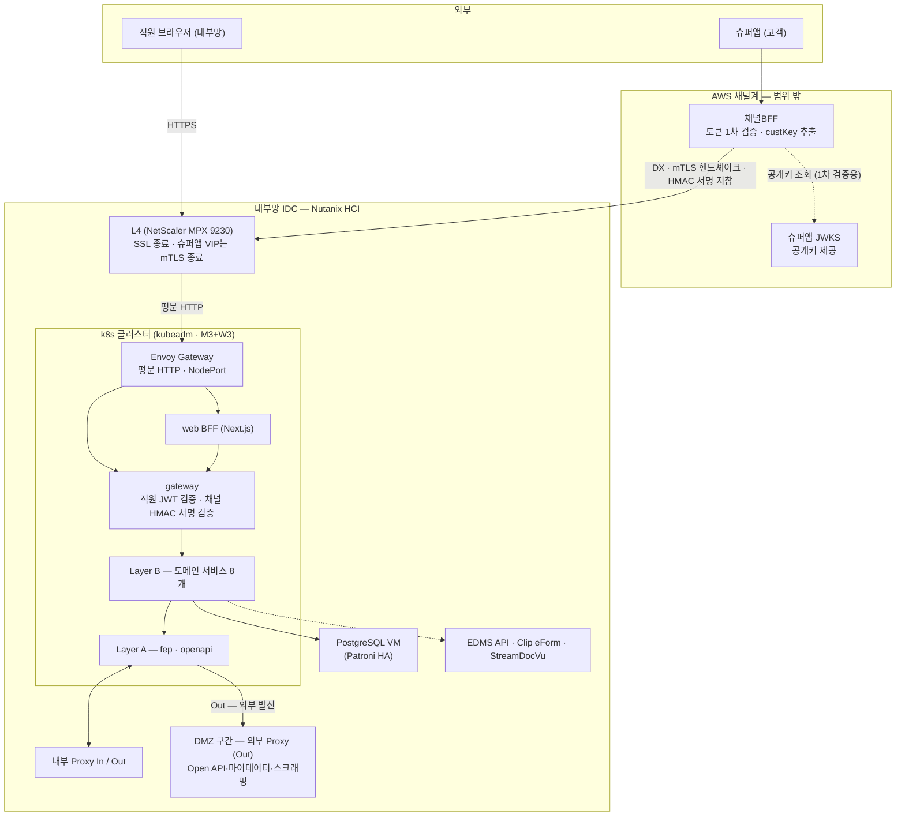
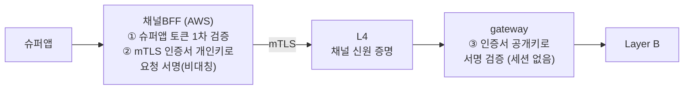
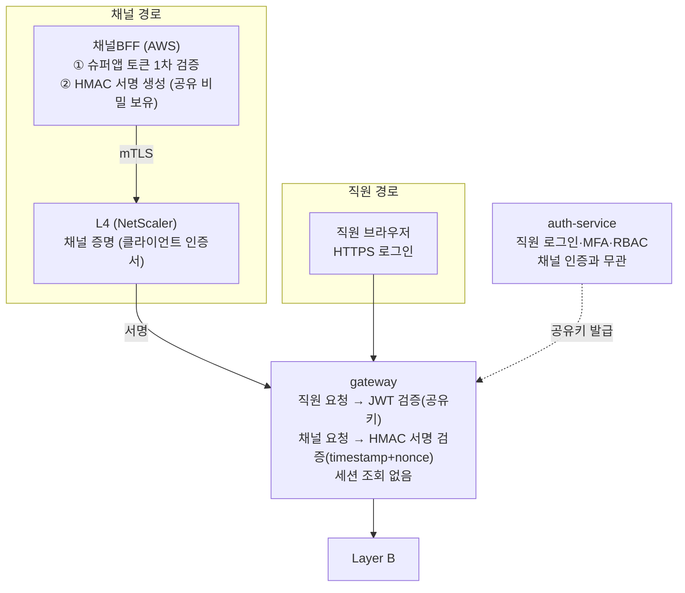
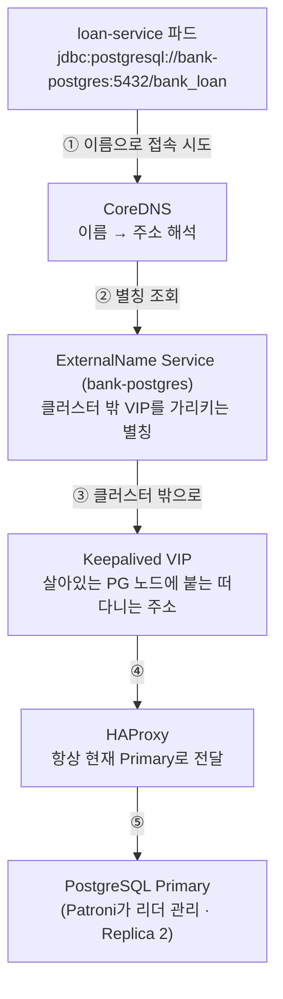
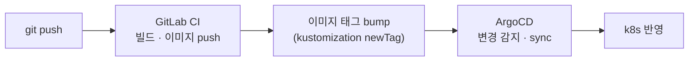

# 실서비스(next.msa) 아키텍처 전체 흐름

근거 문서: `infra/architecture.drawio` — 이 문서는 그 다이어그램을 "요청이 어디로 흘러가는가"
중심으로 풀어쓴 것이다. 이 랩(msa-k3s-lab)은 아래 구조의 **축소 검증판**이며, 어디가 다른지는
맨 마지막 절에 있다.

## 1. 큰 그림 — 두 세계와 그 사이

전체 구조는 크게 두 세계로 나뉜다.

| 세계 | 위치 | 우리가 운영하나 |
|---|---|---|
| **채널계** | AWS (별도 클라우드) | ✕ — 슈퍼앱·채널BFF·JWKS는 범위 밖 |
| **계정계(내부)** | 내부망 IDC — Nutanix HCI 위 | ○ — k8s 클러스터 + 주변 VM 전부 |

두 세계는 **DX(Direct Connect 전용회선)** 로 연결된다. DX는 사설 회선일 뿐 암호화·신원을
보장하지 않으므로, 그 위에 편도 TLS + 매 요청 JWT 검증 + mTLS(옵션 ①)가 얹힌다.



## 2. 요청이 들어오는 길 — 두 진입 경로

### 직원 (내부망 React 웹)

```
직원 브라우저 → L4(SSL 종료) → Envoy Gateway → web BFF → gateway → Layer B
```

- 토큰은 **우리가 발급**한다 — 로그인 시 gateway가 auth-service로 넘겨 HS256(공유키) JWT 발급.
- 이후 매 요청은 gateway가 공유키로 직접 검증. 외부에 물어볼 일이 없다.

### 고객 (슈퍼앱) — 세션 없는 요청 단위 서명 인증

**v1(2026-08-24, HMAC 대칭키)** 을 아래에 상세히 두고, **v2(2026-08-25, mTLS 인증서
키 재사용·비대칭키)** 를 §"요청 하나의 처리" 뒤에 이어서 다룬다. "세션을 두지 않는다"는
방향은 v1·v2 동일 — 차이는 서명 알고리즘과 비밀 관리 방식뿐이다. 상세 비교는
**"채널 인증 방식 비교" 탭** 참고.

#### v1 (2026-08-24 결정) — HMAC 공유 비밀 서명

```
슈퍼앱 → 채널BFF(1차 검증 + HMAC 서명) → DX → L4(mTLS — 옵션 ①) → Envoy Gateway → gateway(서명 검증) → Layer B
```

> **경위**: 처음엔 "같은 슈퍼앱 토큰을 두 번 검증"(2026-08-20), 그다음 "내부 토큰으로
> 교환해 발급"(2026-08-21)을 검토했다. 두 안 모두 "우리 내부에 로그인 상태(세션/토큰)를
> 얼마간 유지한다"는 전제였는데, **슈퍼앱의 로그인·로그아웃을 우리가 감지할 방법이
> 없다**는 게 확인되며 그 전제가 무너졌다 — 우리가 만드는 세션은 진짜 로그인 상태를
> 반영 못 하는 TTL 근사치일 뿐이고, 로그아웃 시 그걸 무효화할 신호조차 못 받는다. 그래서
> 세션 개념 자체를 버리고 아래 방식으로 재결정했다. 전체 검토 과정은 **"채널 인증 방식
> 비교" 탭** 참고.

- 채널BFF는 매 요청마다 슈퍼앱 토큰을 새로 검증(1차, 슈퍼앱 JWKS)하고, 그 검증 결과를
  **그 요청 하나를 인증하는 근거로 즉시 사용**한다 — 별도 토큰을 발급하지 않는다.
- BFF가 요청마다 **HMAC 서명**(공유 비밀 + method·path·timestamp·nonce·custKey)을 만들어
  헤더에 싣고, gateway가 같은 계산으로 서명을 재확인한다. timestamp 창(±60초)과
  nonce 중복 확인(짧은 Redis 캐시)으로 재전송을 막는다.
- L4의 슈퍼앱 전용 VIP가 클라이언트 인증서를 검증(mTLS)해 채널 자체를 증명한다 — 상세
  비교·확정 근거는 **"mTLS 검토안" 탭** 참고. **mTLS(채널 증명)와 HMAC(요청 증명)이
  서로 다른 비밀에 의존**해 한쪽이 뚫려도 방어가 남는다.
- 저장되는 세션·토큰이 없으므로 **폐기할 것도, 만료를 관리할 것도 없다.** "로그아웃"은
  다음 요청 때 1차 검증이 자연히 실패하는 것으로 끝 — 별도 감지·통지·연동이 필요 없다.

#### 왜 세션을 버렸나

| | 세션 기반(토큰 발급/교환) | **세션 없는 요청 서명 (채택)** |
|---|---|---|
| "로그인 상태" | 발급소 또는 세션 저장소에 보관 | **보관 안 함 — 매번 새로 증명** |
| 로그아웃 처리 | 폐기 로직 필요(감지 불가로 실은 구현 불가) | **처리할 게 없음** |
| 유효기간의 의미 | 슈퍼앱은 로그아웃했는데 우리만 몇 분 더 살아있는 근사치 창 | **없음 — 매 요청이 그 순간의 진실** |
| 새 인프라 | 발급 서버 또는 세션 저장소 | **없음** |
| 왕복 비용 | 교환 API 왕복 또는 세션 조회 | **0회 — 로컬 CPU 연산** |

#### 요청 하나의 처리

| 단계 | 지점 | 일어나는 일 |
|---|---|---|
| 0 | 슈퍼앱 로그인 | 슈퍼앱이 토큰 T 발급 (우리와 무관, 우리는 이 시점을 모른다) |
| 1 | 미니앱 → API 호출 | T가 요청에 실림 |
| 2 | 채널BFF | T를 슈퍼앱 JWKS로 검증(1차) + custKey 추출 + **이 요청에 HMAC 서명** |
| 3 | DX → L4 | 토큰·서명은 안 본다. mTLS로 "호출자가 진짜 채널BFF인가"만 확인(채널 검증) |
| 4 | Envoy Gateway | 라우팅만 |
| 5 | gateway | 서명 + timestamp + nonce 확인 — **세션 조회 없음, 이 요청만 검증** |
| 6 | gateway 통과 | 신원을 헤더(`X-Account-Id`/`Roles`/`X-Principal-Type`)로 변환 |
| 7 | Layer B | 헤더만 읽는다. 서명·JWT를 전혀 모른다(ClusterIP 내부 신뢰) |

이 흐름의 남은 빈칸은 체크리스트 ④의 미해결 항목 하나뿐이다: custKey(슈퍼앱 세계의
식별자)를 내부 고유번호 cust_unno로 번역하는 지점. (로그아웃 즉시 무효화는 세션 자체가
없어져 문제가 소멸했다.)

#### v2 (2026-08-25 결정, 권장) — mTLS 인증서 키 재사용 서명

**v1의 남은 약점**: HMAC은 대칭키라 채널BFF와 gateway가 같은 비밀 값을 나눠 갖는다. 그
값 하나가 유출되면 유출시킨 쪽이 어디든 상관없이 임의의 고객 요청을 완벽하게 위조할 수
있고, 세션이 없어 "이 세션만 무효화"도 못 한다 — 대응은 비밀을 통째로 교체하는 것뿐이다.

**핵심 아이디어**: 새 비밀을 만들지 않고, **채널BFF가 mTLS 핸드셰이크에 이미 쓰고 있는
클라이언트 인증서의 개인키**로 요청에 서명한다. gateway는 그 인증서의 **공개키**만
있으면 검증할 수 있다 — 우리가 발급·관리하는 CA의 인증서라 타사 의존 문제도 아니다.



| | v1: HMAC 공유 비밀(대칭) | **v2: mTLS 키 재사용(비대칭)** |
|---|---|---|
| gateway가 들고 있는 값 | 위조에 쓸 수 있는 비밀 그 자체 | 공개키뿐 — 유출돼도 위조 불가 |
| 유출 시 파급 | 전체 채널 즉시 위조 가능 | **위조 불가** — 개인키는 BFF에만 있음 |
| 새로 만들 것 | 비밀 생성·배포·회전 절차 | **없음** — 기존 mTLS 인증서 수명주기에 얹힘 |
| 표준 근거 | 사내 자체 규격 | **IETF 표준(RFC 9421)** |

v1의 "AWS Secrets Manager / k8s Secret 공유 비밀" 절차가 v2에서는 필요 없다 — 별도
비밀을 안 만드므로 배포·회전 협의 자체가 사라지고, mTLS 인증서 발급·교체 절차("mTLS
검토안" 탭)를 그대로 따른다. 재전송 방지(timestamp+nonce, Redis)는 v1과 동일하다. 구현
난이도가 v1보다 조금 높다는 게 유일한 대가라, 상세 소스 스케치와 "언제 v1/v2를 쓰나"는
**"채널 인증 방식 비교" 탭**에 정리해뒀다.

#### 서비스별 역할 분담 (v1 기준, v2도 구조 동일)

채널 경로(고객)와 직원 경로는 **gateway 한 곳에서만 만난다** — 그 전엔 완전히 독립된
흐름이다.



| 서비스/서버 | 최종 역할 |
|---|---|
| **채널BFF (AWS)** | 슈퍼앱 토큰 1차 검증 + 요청마다 HMAC 서명 생성. 공유 비밀 보유. 왕복·저장 없음(무상태 유지) |
| **L4 (NetScaler)** | mTLS로 "진짜 채널BFF"라는 채널 자체를 증명 |
| **gateway** | 직원 요청은 JWT(공유키), 채널 요청은 HMAC 서명 — 요청 종류로 분기 검증. 세션 조회 없음 |
| **auth-service** | 직원 로그인·MFA·RBAC 전담으로 원복 — 채널 토큰 교환 발급 기능 제거, 채널BFF의 존재를 몰라도 됨 |
| **Redis** | 세션 저장 아님 — nonce 재전송 방지용 초단기 캐시만 |

##### ① 채널BFF — 이번에 가장 많은 일을 새로 떠맡은 지점

두 단계로 나뉜다.

1. **1차 검증** — 지금까지와 동일. 슈퍼앱이 서명한 토큰을 슈퍼앱 JWKS 공개키로 검증하고
   custKey를 꺼낸다.
2. **HMAC 서명 생성 — 새로 추가된 일** — 검증에 성공한 **이 요청 하나**에 대해, 미리
   나눠 가진 공유 비밀(shared secret)로 서명을 만든다.

```
서명 대상 = method + path + timestamp + nonce + custKey
signature = HMAC-SHA256(공유비밀, 서명대상)
헤더로 전송: X-Signature, X-Timestamp, X-Nonce, X-CustKey
```

**"세션 없음"이 강조된 이유** — 예전 안(교환)에서는 이 단계가 auth-service에 왕복해서
토큰을 받아오는 네트워크 호출이었다. 지금은 **로컬 CPU 연산 한 줄**이다. 왕복이 없고,
BFF가 뭔가를 저장해둘 필요도 없다(여전히 무상태 유지). 공유 비밀 자체는 k8s Secret/AWS
Secrets Manager로 배포·주기적 회전한다.

##### ② gateway — 검증 로직이 두 개로 갈라짐

이제 하나의 검증 로직이 아니라, 요청 종류에 따라 **분기**한다. 직원 쪽은 손대지 않았다 —
여전히 auth-service가 발급한 JWT를 같은 공유키로 검증한다. **채널 쪽만 완전히 새
방식**이다 — 토큰을 열어보는 게 아니라 서명을 재계산해서 대조한다. 통과하면 두 경로
모두 최종적으로 같은 형태(헤더)로 변환돼 하위 서비스로 내려간다 — 하위 서비스 입장에서는
직원이든 채널이든 구분 없이 똑같은 헤더만 본다.

##### ③ auth-service — 채널 발급 역할 제거, 원래(직원 전용)로 복원

어제까지 이 서비스에 추가했던 "채널 토큰 교환 발급" 기능을 통째로 되돌렸다.

- 하는 일: 직원 로그인 처리, MFA, RBAC, JWT 발급 — **그대로**.
- 더 이상 하는 일: 채널BFF의 자격증명 검사, 내부 토큰 교환 발급 — **없음**. 이 서비스는
  이제 슈퍼앱이나 채널BFF의 존재 자체를 몰라도 된다.

**왜 이게 중요한가** — 어제 설계는 auth-service가 "직원 인증 + 채널 인증 발급" 두 책임을
지게 만들었는데, 이번 결정으로 **책임이 완전히 분리**된다. auth-service 장애는 이제 직원
로그인에만 영향을 주고, 채널(고객) 트래픽과는 무관하다 — HMAC 서명 검증에 auth-service를
전혀 거치지 않기 때문이다.

##### ④ DX 구간에서 실리는 것

이전엔 "교환된 내부 토큰 지참"이었다. 이제는 **애초에 지참할 "토큰"이 없다** — 채널BFF가
그 요청을 위해 방금 계산한 서명 값 하나가 그 요청과 함께 실려 갈 뿐이다. "매 요청
검증됨"이라는 성질은 그대로인데 의미가 미묘하게 달라졌다 — 예전엔 "토큰의 유효성을 매번
검증", 지금은 **"이 서명 자체가 이 요청 전용이라 재검증이라는 개념이 없고, 매번 새로
증명"**이다.

##### ⑤ drawio 인증 경로 비교 섹션 — "발급 서버 없음" 안내 박스

기존에 있던 "auth-service — 교환 요청에 내부 토큰 발급" 박스와 그리로 가는 화살표
2개를 지웠다. 그 자리에 회색 점선 안내 박스 하나만 남았다: **"발급 서버 없음 — 세션·토큰을
두지 않는다."** 이 박스는 기능이 있는 컴포넌트가 아니라 **"여기 뭔가 있어야 하는데 없는
게 맞다"는 걸 명시적으로 알려주는 라벨**이다. 다이어그램을 훑어보는 사람이 "채널 인증하는
서버가 안 보이는데 빠뜨린 건가?"라고 오해하지 않도록, "빠뜨린 게 아니라 원래 없다"를
시각적으로 못 박아둔 것이다.

##### ⑥ 체크리스트 ④ — 결정 상태 갱신

- **[결정, 2026-08-24]** — 세션 없는 HMAC 서명, mTLS+HMAC 이중 방어라는 결론이 한 항목에
  요약돼 있다. 발표·보고 때 이 한 줄만 보여줘도 결론이 전달된다.
- **[해결] 로그아웃 폐기 문제 소멸** — 예전엔 "고객 토큰의 로그아웃 즉시 폐기 개념이
  없음"이 **미해결**로 남아 있었는데, 이제 **해결로 상태가 바뀌었다.** 정확히는 "풀어서
  해결"이 아니라 "문제 자체가 없어져서 해결" — 폐기할 토큰이 애초에 없기 때문이다.
- **[미해결] custKey→cust_unno 변환 지점** — 유일하게 남은 항목. 이번 결정과 무관하게
  여전히 열려 있다.

##### ⑦ 빨간 히스토리 박스 2개 — 왜 둘 다 남기나

| 박스 | 담긴 내용 |
|---|---|
| "변경됨 (2026-08-21)" | 1세대(JWKS 직접 2차검증) → 2세대(토큰 교환)로 바뀐 이유 |
| "변경됨 (2026-08-24)" | 2세대(토큰 교환) → 3세대(요청 서명)로 바뀐 이유 |

두 번의 방향 전환이 순서대로 기록된다. 나중에 이 문서를 처음 보는 사람(혹은 몇 달 뒤의
우리)이 "왜 JWKS로 안 했지?"뿐 아니라 **"왜 토큰 교환 방식으로도 안 갔지?"**까지 궁금해할
수 있기 때문이다. 두 번째 박스가 그 답(로그인·로그아웃 감지 불가 → 세션 개념 자체가
무의미)을 미리 준비해둔다. 히스토리를 지우지 않고 쌓아가는 게 이 문서 전체의 일관된
관례다.

**gateway의 분기 검증 스케치**:

```kotlin
fun authenticate(request: HttpRequest): Principal {
    return if (request.hasHeader("X-Signature")) {
        // 채널(고객) 요청 — HMAC 서명 검증
        channelRequestVerifier.verify(request)  // 서명 + timestamp(±60초) + nonce 중복 확인
    } else {
        // 직원 요청 — 기존 그대로, JWT 공유키 검증
        employeeJwtVerifier.verify(request.bearerToken)
    }
}
```

통과하면 두 경로 모두 같은 형태(`X-Account-Id`/`Roles`/`X-Principal-Type` 헤더)로 변환돼
하위 서비스로 내려간다 — 하위 서비스 입장에서는 직원이든 채널이든 구분 없이 똑같은
헤더만 보인다.

**`infra/architecture.drawio` 표기 참고** — 인증 경로 비교 섹션에서 예전 "auth-service —
교환 요청에 내부 토큰 발급" 박스가 있던 자리는 이제 **"발급 서버 없음 — 세션·토큰을
두지 않는다"** 안내 박스로 대체됐다(기능이 아니라 "원래 없는 게 맞다"는 표시). 그 결정에
이르기까지의 경위(①JWKS 직접 2차검증 → ②토큰 교환 → ③현재의 요청 서명)는 체크리스트 ④
옆 빨간 히스토리 박스 2개에 순서대로 남아 있다 — 지우지 않고 쌓아가는 것이 이 문서의 관례다.

## 3. 클러스터 안 — 세 개의 레이어

호출은 **위에서 아래로만** 흐른다 (C → B → A). 역방향 호출은 순환 의존을 만들어 금지.

| 레이어 | 구성 | 역할 |
|---|---|---|
| **Layer C** — 화면 중심 | web BFF(Next.js), gateway | 채널 진입 수용 — web은 화면 단위 응답 조합, gateway는 직원 JWT·채널 HMAC 서명 검증 |
| **Layer B** — 도메인 | loan(여신·심사) · bond(채권) · deposit(수신, 미확정) · customer(고객) · callcenter(상담) · user(직원·조직) · system(공통코드·메뉴·권한) · ums(메시징) | 업무 도메인 API. 서비스별 자기 DB 소유 |
| **Layer A** — 통신 | fep(전문 통신), openapi(HTTP/JSON) | 외부 계정계 연계 단독 책임. **Layer B를 역호출하지 않는다** |

- Layer B 안에서도 **system은 최하위** — 아무 서비스도 호출하지 않는 공통 참조 계층이다.
- 서비스 간 조회는 조인이 아니라 **port-out**(`{subdomain}/client/` interface + Adapter)으로.

### Layer A의 문 — 나가는 곳과 들어오는 곳

| 경로 | 방향 | 상대 |
|---|---|---|
| fep → 내부 Proxy (Out) | 발신 — 전용선 | 중앙회 · KCB/NICE |
| 내부 Proxy (In) → fep | 수신 — 전용선 | 오토비긴즈 · NICE DNR · 카히스토리 · 쿠콘 |
| openapi → **DMZ 외부 Proxy (Out)** | 발신 — IDC 내 DMZ 구간 경유 인터넷 | Open API · 마이데이터 · 스크래핑 |

- openapi의 외부 발신은 원래 AWS 채널계의 외부 Proxy를 DX로 경유하는 안이었으나,
  **IDC 안에 DMZ 구간을 신설해 그쪽으로 나가는 방향으로 변경**됐다. DMZ는 내부망과
  방화벽으로 격리된 완충지대라 이 구간이 침해돼도 내부망 직접 침투를 막고, 기관
  화이트리스트용 고정 출발지 IP도 이 프록시가 담당한다.

## 4. 데이터·주변 인프라 — k8s 안과 밖

| 구성요소 | 위치 | 요점 |
|---|---|---|
| PostgreSQL | **k8s 밖** VM 3대 | Patroni+etcd+HAProxy HA. 클러스터에서는 ExternalName(`bank-postgres`)으로 접근. **서비스별 분리 DB** — 테이블 소유는 코드가 아니라 DB가 정한다 |
| Redis | k8s 안 | Sentinel HA 3노드(master1+replica2, quorum 2) — 캐시·세션 |
| Kafka | k8s 안 | KRaft 3노드(ZooKeeper 없음) — 이벤트. PVC는 NFS 대신 로컬 디스크 권장 |
| NFS 파일/로그 | **k8s 밖** 서버 2대 | StorageClass 2개(nfs-client-file / nfs-client-log)로 PVC 자동 프로비저닝 |
| EDMS API · Clip eForm · StreamDocVu | **k8s 밖** 전용 VM | 상용 라이선스라 컨테이너화하지 않음 — 이중화 VM 1대 추가 예정. Layer B가 port-out으로 호출 |
| LGTM | k8s 안 | Loki(로그)·Grafana(시각화)·Tempo(추적)·Mimir(지표) — 로그는 NFS 로그 스토리지에 적재 |

### k8s ↔ PostgreSQL 연결 상세 — 이름 한 겹, 장애를 흡수하는 층 네 개

앱(서비스)은 DB의 실제 IP를 모른다. 아는 것은 이름 하나뿐이고, 그 아래로 층층이
장애 흡수 장치가 깔려 있다.



**연결 흐름** — ① 앱의 JDBC URL에는 `bank-postgres`라는 이름만 있다 → ② CoreDNS가
ExternalName Service를 보고 "클러스터 밖 VIP 주소"로 풀어준다 → ③④ 트래픽이 VIP가
붙어있는 PG 노드에 도착 → ⑤ 그 노드의 HAProxy가 현재 Primary로 넘긴다.

**왜 이름을 한 겹 씌우나** — 실제 주소를 9개 서비스 설정에 직접 박으면, DB 이전이나
주소 변경 때 9개 전부 수정·재배포해야 한다. ExternalName을 끼우면 고칠 곳이 Service
오브젝트 하나이고 앱들은 재배포 없이 다음 DNS 조회부터 새 주소를 받는다.

**장애를 층마다 나눠 받는다** — 어느 사건이든 앱에 보이는 주소는 불변이 설계 목표다.

| 장애 | 받아주는 층 | 앱이 겪는 것 |
|---|---|---|
| Primary DB 죽음 | Patroni가 Replica 승격 → HAProxy가 방향 전환 | 수 초 연결 끊김 → HikariCP가 풀 재수립 → 계속. 주소 그대로 |
| VIP 붙은 노드 죽음 | Keepalived가 VIP를 다른 노드로 이동 | 위와 동일 |
| DB 통째로 이전 | ExternalName 값만 수정 | 앱 재배포 없음 |

층마다 담당이 다르다: Patroni는 "누가 Primary냐", Keepalived는 "주소가 어디 붙느냐",
HAProxy는 "접속을 어디로 보내느냐", ExternalName은 "클러스터가 뭐라고 부르느냐".

**나머지 조각 셋**

- **비밀번호** — 주소는 이름으로 풀리지만 인증은 별개. 서비스별 DB 비밀번호는 전부
  k8s Secret으로 주입되고 코드에는 `${DB_PASSWORD}` 자리만 있다. Secret이 안 꽂히면
  기본값으로 조용히 뜨는 게 아니라 기동 실패(fail-fast).
- **DB per service** — 같은 VIP로 들어가도 서비스마다 자기 데이터베이스(bank_loan,
  bank_user…)에만 붙는다. JDBC URL의 DB명과 계정이 서비스마다 달라서, 남의 테이블
  직접 조회는 물리적으로 차단 — "테이블 소유는 DB가 정한다" 원칙의 강제 장치.
- **HikariCP(커넥션 풀)** — 쿼리마다 위 ①~⑤를 새로 밟으면 느리니, 파드가 뜰 때 연결
  몇 개를 미리 맺어두고 재사용한다. DNS 조회·연결 수립은 풀 생성이나 장애 후
  재수립 때만 일어난다.

## 5. 클러스터를 떠받치는 것들 (직접 설치 대상)

표준 k8s(kubeadm)는 아래 어느 것도 내장하지 않는다 — 전부 골라서 설치하는 것들이다.

| 컴포넌트 | 역할 | 없으면 |
|---|---|---|
| **Calico** (CNI) | 파드 네트워크 자체를 만듦 — VXLAN 오버레이 + NetworkPolicy 시행 | 파드 간 통신 불가, 전 노드 NotReady |
| **CoreDNS** | 서비스 이름 → IP 자동 변환 | 이름으로 호출 불가 |
| **Envoy Gateway** | Gateway API 구현체 — 컨트롤러(yaml 읽고 설정)와 프록시(실제 트래픽 수신, L4 백엔드로 등록) 두 파드로 동작 | 외부 트래픽이 들어올 문이 없음 |
| **metrics-server** | kubectl top·HPA가 쓰는 리소스 사용량 API — LGTM(사람용)과 별개로 k8s 자신이 소비 | kubectl top 불가, HPA 동작 안 함 |
| **kube-vip** | API 서버 앞단 VIP — Master 3대 중 죽은 노드가 있어도 접속 유지 | Master 1대 장애 시 kubectl 접속 단절 위험 |
| **ArgoCD** | GitOps — git 선언 상태를 감시해 자동 반영 | 사람이 kubectl apply 하는 수동 배포로 회귀 |
| NFS provisioner ×2 | PVC 생성 시 NFS에 하위 폴더 자동 생성 | PVC가 영원히 Pending |

cert-manager는 **설치하지 않는다** — TLS 종료를 전부 L4가 하고 클러스터 안은 평문이라
관리할 인증서가 없다. 내부 구간 암호화 요구가 생기면 재검토.

## 6. 배포 흐름 — 사람이 kubectl을 치지 않는다



- 단 **Secret은 git에 없다** — ArgoCD sync 대상이 아니고 kubectl로 직접 주입한다.
  DB 비밀번호·JWT 키가 git에 올라가지 않는 이유.

## 7. 이 랩(msa-k3s-lab)과 다른 점

이 랩은 위 구조에서 보안 개념(JWKS·custKey·jti·mTLS)만 떼어 로컬에서 증명한 축소판이다.

| | 실서비스 | 이 랩 |
|---|---|---|
| 진입 체인 | L4 → Envoy Gateway → gateway | superapp-proxy → gateway (중간 장비 없음) |
| mTLS 종료 | **L4 (옵션 ①, NetScaler)** | gateway 자신 (옵션 ③) — 로컬에 L4가 없어서 |
| 고객 인증 | BFF가 JWKS로 1차 검증 후 **매 요청 HMAC 서명** — 세션·토큰 없음 | gateway가 JWKS로 직접 검증(고객 토큰 방식만 구현) |
| 직원 토큰 | HS256 공유키 | RS256 + JWKS (랩은 JWKS 방식만 구현) |
| DB | 외부 VM Patroni HA | 컨테이너 단일 인스턴스 |
| 도메인 서비스 | 8개 | 2개 (order/product) |

랩 자체의 배선과 검증 절차는 **"흐름 설명 (FLOW.md)" 탭**, mTLS 옵션 비교와 검토 근거는
**"mTLS 검토안" 탭** 참고.
