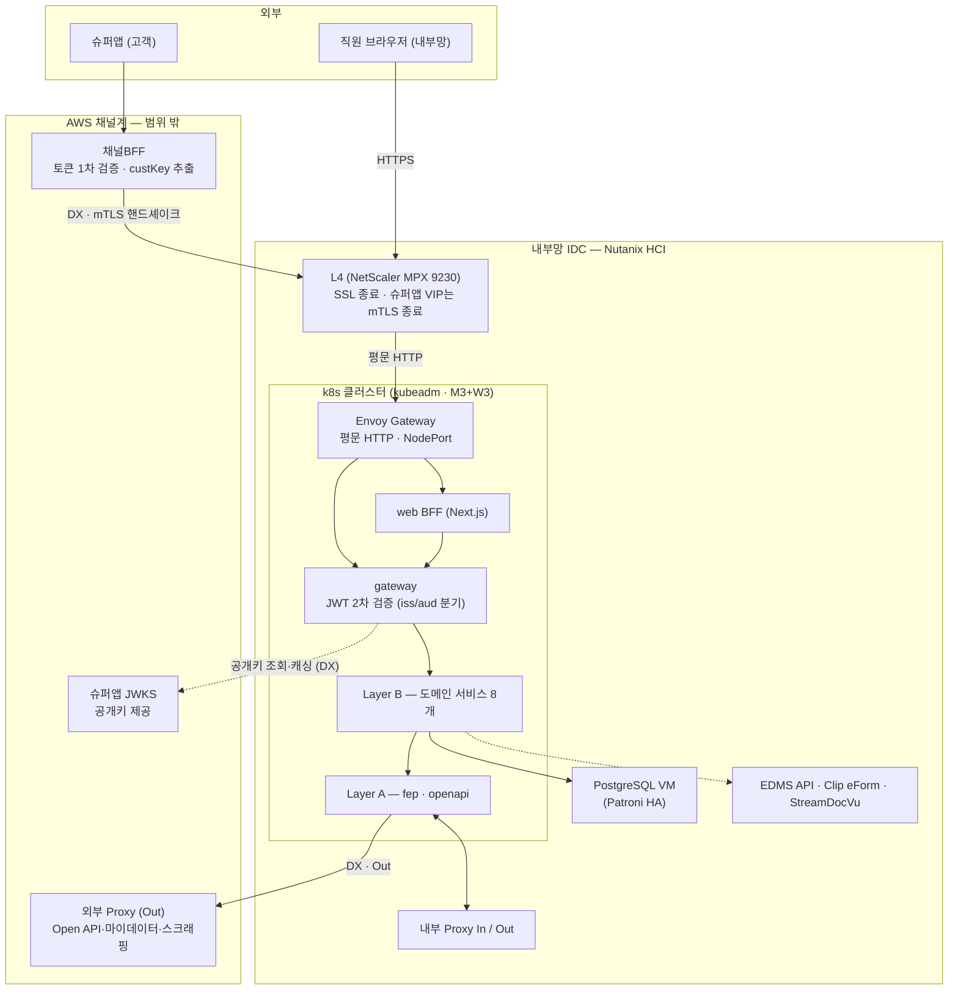
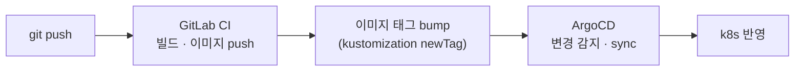

# 실서비스(next.msa) 아키텍처 전체 흐름

근거 문서: `infra/architecture.drawio` — 이 문서는 그 다이어그램을 "요청이 어디로 흘러가는가"
중심으로 풀어쓴 것이다. 이 랩(msa-k3s-lab)은 아래 구조의 **축소 검증판**이며, 어디가 다른지는
맨 마지막 절에 있다.

## 1. 큰 그림 — 두 세계와 그 사이

전체 구조는 크게 두 세계로 나뉜다.

| 세계 | 위치 | 우리가 운영하나 |
|---|---|---|
| **채널계** | AWS (별도 클라우드) | ✕ — 슈퍼앱·채널BFF·JWKS는 범위 밖 |
| **계정계(내부)** | 내부망 IDC — Nutanix HCI 위 | ○ — k8s 클러스터 + 주변 VM 전부 |

두 세계는 **DX(Direct Connect 전용회선)** 로 연결된다. DX는 사설 회선일 뿐 암호화·신원을
보장하지 않으므로, 그 위에 편도 TLS + 매 요청 JWT 검증 + mTLS(옵션 ①)가 얹힌다.



## 2. 요청이 들어오는 길 — 두 진입 경로

### 직원 (내부망 React 웹)

```
직원 브라우저 → L4(SSL 종료) → Envoy Gateway → web BFF → gateway → Layer B
```

- 토큰은 **우리가 발급**한다 — 로그인 시 gateway가 auth-service로 넘겨 HS256(공유키) JWT 발급.
- 이후 매 요청은 gateway가 공유키로 직접 검증. 외부에 물어볼 일이 없다.

### 고객 (슈퍼앱)

```
슈퍼앱 → 채널BFF(AWS, 1차 검증) → DX → L4(mTLS 종료 ← 옵션 ① 채택) → Envoy Gateway → gateway → Layer B
```

- 토큰은 **슈퍼앱이 발급**한다 — 우리는 슈퍼앱 JWKS 공개키로 **검증만** 한다(발급 불가).
- L4의 슈퍼앱 전용 VIP가 클라이언트 인증서를 검증(mTLS)하고, 검증된 CN을 헤더로 하위 전달 —
  상세 비교·확정 근거는 **"mTLS 검토안" 탭** 참고.
- 두 경로 모두 **gateway 하나로 합류**하고, 토큰의 iss/aud를 보고 직원용/고객용 검증 로직을
  분기한다. 인증 경계는 gateway 하나 — 통과한 요청만 하위로 가고, 하위 서비스는 재검증하지
  않는다(ClusterIP 내부 신뢰).

## 3. 클러스터 안 — 세 개의 레이어

호출은 **위에서 아래로만** 흐른다 (C → B → A). 역방향 호출은 순환 의존을 만들어 금지.

| 레이어 | 구성 | 역할 |
|---|---|---|
| **Layer C** — 화면 중심 | web BFF(Next.js), gateway | 채널 진입 수용 — web은 화면 단위 응답 조합, gateway는 JWT 2차 검증 |
| **Layer B** — 도메인 | loan(여신·심사) · bond(채권) · deposit(수신, 미확정) · customer(고객) · callcenter(상담) · user(직원·조직) · system(공통코드·메뉴·권한) · ums(메시징) | 업무 도메인 API. 서비스별 자기 DB 소유 |
| **Layer A** — 통신 | fep(전문 통신), openapi(HTTP/JSON) | 외부 계정계 연계 단독 책임. **Layer B를 역호출하지 않는다** |

- Layer B 안에서도 **system은 최하위** — 아무 서비스도 호출하지 않는 공통 참조 계층이다.
- 서비스 간 조회는 조인이 아니라 **port-out**(`{subdomain}/client/` interface + Adapter)으로.

### Layer A의 문 — 나가는 곳과 들어오는 곳

| 경로 | 방향 | 상대 |
|---|---|---|
| fep → 내부 Proxy (Out) | 발신 — 전용선 | 중앙회 · KCB/NICE |
| 내부 Proxy (In) → fep | 수신 — 전용선 | 오토비긴즈 · NICE DNR · 카히스토리 · 쿠콘 |
| openapi → 외부 Proxy (Out, AWS) | 발신 — DX | Open API · 마이데이터 · 스크래핑 |

## 4. 데이터·주변 인프라 — k8s 안과 밖

| 구성요소 | 위치 | 요점 |
|---|---|---|
| PostgreSQL | **k8s 밖** VM 3대 | Patroni+etcd+HAProxy HA. 클러스터에서는 ExternalName(`bank-postgres`)으로 접근. **서비스별 분리 DB** — 테이블 소유는 코드가 아니라 DB가 정한다 |
| Redis | k8s 안 | Sentinel HA 3노드(master1+replica2, quorum 2) — 캐시·세션 |
| Kafka | k8s 안 | KRaft 3노드(ZooKeeper 없음) — 이벤트. PVC는 NFS 대신 로컬 디스크 권장 |
| NFS 파일/로그 | **k8s 밖** 서버 2대 | StorageClass 2개(nfs-client-file / nfs-client-log)로 PVC 자동 프로비저닝 |
| EDMS API · Clip eForm · StreamDocVu | **k8s 밖** 전용 VM | 상용 라이선스라 컨테이너화하지 않음 — 이중화 VM 1대 추가 예정. Layer B가 port-out으로 호출 |
| LGTM | k8s 안 | Loki(로그)·Grafana(시각화)·Tempo(추적)·Mimir(지표) — 로그는 NFS 로그 스토리지에 적재 |

## 5. 클러스터를 떠받치는 것들 (직접 설치 대상)

표준 k8s(kubeadm)는 아래 어느 것도 내장하지 않는다 — 전부 골라서 설치하는 것들이다.

| 컴포넌트 | 역할 | 없으면 |
|---|---|---|
| **Calico** (CNI) | 파드 네트워크 자체를 만듦 — VXLAN 오버레이 + NetworkPolicy 시행 | 파드 간 통신 불가, 전 노드 NotReady |
| **CoreDNS** | 서비스 이름 → IP 자동 변환 | 이름으로 호출 불가 |
| **Envoy Gateway** | Gateway API 구현체 — 컨트롤러(yaml 읽고 설정)와 프록시(실제 트래픽 수신, L4 백엔드로 등록) 두 파드로 동작 | 외부 트래픽이 들어올 문이 없음 |
| **metrics-server** | kubectl top·HPA가 쓰는 리소스 사용량 API — LGTM(사람용)과 별개로 k8s 자신이 소비 | kubectl top 불가, HPA 동작 안 함 |
| **kube-vip** | API 서버 앞단 VIP — Master 3대 중 죽은 노드가 있어도 접속 유지 | Master 1대 장애 시 kubectl 접속 단절 위험 |
| **ArgoCD** | GitOps — git 선언 상태를 감시해 자동 반영 | 사람이 kubectl apply 하는 수동 배포로 회귀 |
| NFS provisioner ×2 | PVC 생성 시 NFS에 하위 폴더 자동 생성 | PVC가 영원히 Pending |

cert-manager는 **설치하지 않는다** — TLS 종료를 전부 L4가 하고 클러스터 안은 평문이라
관리할 인증서가 없다. 내부 구간 암호화 요구가 생기면 재검토.

## 6. 배포 흐름 — 사람이 kubectl을 치지 않는다



- 단 **Secret은 git에 없다** — ArgoCD sync 대상이 아니고 kubectl로 직접 주입한다.
  DB 비밀번호·JWT 키가 git에 올라가지 않는 이유.

## 7. 이 랩(msa-k3s-lab)과 다른 점

이 랩은 위 구조에서 보안 개념(JWKS·custKey·jti·mTLS)만 떼어 로컬에서 증명한 축소판이다.

| | 실서비스 | 이 랩 |
|---|---|---|
| 진입 체인 | L4 → Envoy Gateway → gateway | superapp-proxy → gateway (중간 장비 없음) |
| mTLS 종료 | **L4 (옵션 ①, NetScaler)** | gateway 자신 (옵션 ③) — 로컬에 L4가 없어서 |
| 직원 토큰 | HS256 공유키 | RS256 + JWKS (랩은 고객 방식만 구현) |
| DB | 외부 VM Patroni HA | 컨테이너 단일 인스턴스 |
| 도메인 서비스 | 8개 | 2개 (order/product) |

랩 자체의 배선과 검증 절차는 **"흐름 설명 (FLOW.md)" 탭**, mTLS 옵션 비교와 채택 근거는
**"mTLS 검토안" 탭** 참고.
