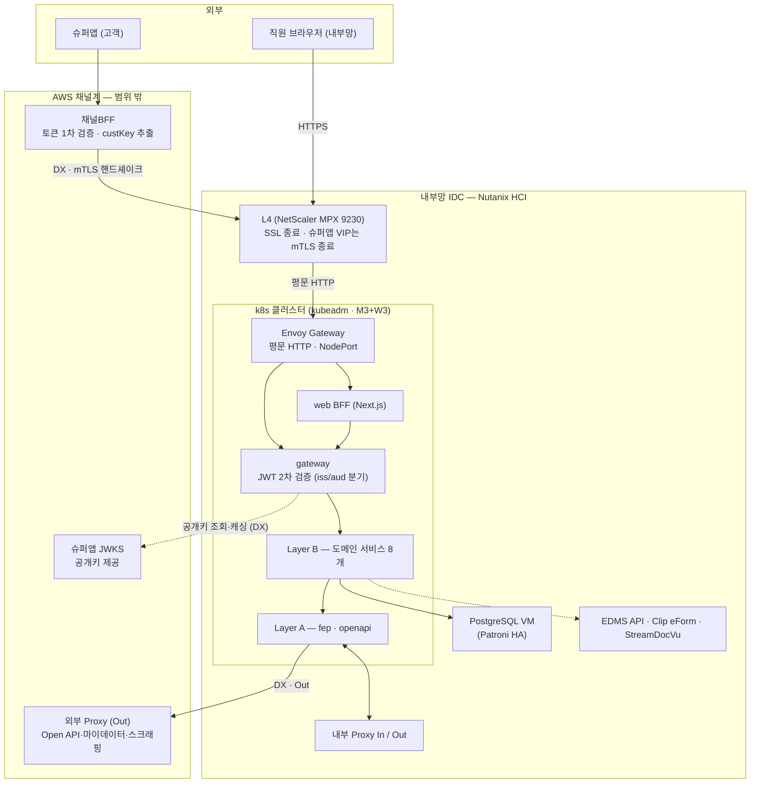
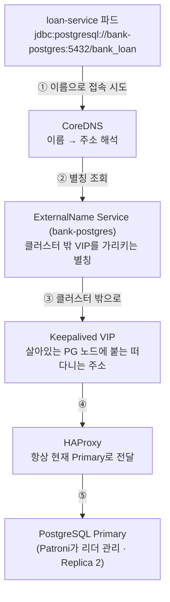
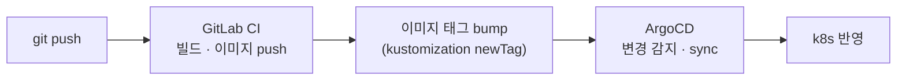

# 실서비스(next.msa) 아키텍처 전체 흐름

근거 문서: `infra/architecture.drawio` — 이 문서는 그 다이어그램을 "요청이 어디로 흘러가는가"
중심으로 풀어쓴 것이다. 이 랩(msa-k3s-lab)은 아래 구조의 **축소 검증판**이며, 어디가 다른지는
맨 마지막 절에 있다.

## 1. 큰 그림 — 두 세계와 그 사이

전체 구조는 크게 두 세계로 나뉜다.

| 세계 | 위치 | 우리가 운영하나 |
|---|---|---|
| **채널계** | AWS (별도 클라우드) | ✕ — 슈퍼앱·채널BFF·JWKS는 범위 밖 |
| **계정계(내부)** | 내부망 IDC — Nutanix HCI 위 | ○ — k8s 클러스터 + 주변 VM 전부 |

두 세계는 **DX(Direct Connect 전용회선)** 로 연결된다. DX는 사설 회선일 뿐 암호화·신원을
보장하지 않으므로, 그 위에 편도 TLS + 매 요청 JWT 검증 + mTLS(옵션 ①)가 얹힌다.



## 2. 요청이 들어오는 길 — 두 진입 경로

### 직원 (내부망 React 웹)

```
직원 브라우저 → L4(SSL 종료) → Envoy Gateway → web BFF → gateway → Layer B
```

- 토큰은 **우리가 발급**한다 — 로그인 시 gateway가 auth-service로 넘겨 HS256(공유키) JWT 발급.
- 이후 매 요청은 gateway가 공유키로 직접 검증. 외부에 물어볼 일이 없다.

### 고객 (슈퍼앱)

```
슈퍼앱 → 채널BFF(AWS, 1차 검증) → DX → L4(mTLS 종료 — 옵션 ①) → Envoy Gateway → gateway → Layer B
```

- 토큰은 **슈퍼앱이 발급**한다 — 우리는 슈퍼앱 JWKS 공개키로 **검증만** 한다(발급 불가).
- L4의 슈퍼앱 전용 VIP가 클라이언트 인증서를 검증(mTLS)하고, 검증된 CN을 헤더로 하위 전달 —
  상세 비교·확정 근거는 **"mTLS 검토안" 탭** 참고.
- 두 경로 모두 **gateway 하나로 합류**하고, 토큰의 iss/aud를 보고 직원용/고객용 검증 로직을
  분기한다. 인증 경계는 gateway 하나 — 통과한 요청만 하위로 가고, 하위 서비스는 재검증하지
  않는다(ClusterIP 내부 신뢰).

#### 같은 토큰을 왜 두 번 검증하나 — 채널BFF(1차) + gateway(2차)

신뢰 경계가 다르기 때문이다.

- **채널BFF의 1차 검증**은 AWS 채널계, 즉 **우리 운영 범위 밖**에서 일어난다. 여기서
  걸러지면 쓰레기 요청이 DX 회선과 내부망에 도달하기 전에 차단된다 — 회선·클러스터를
  보호하는 첫 번째 문이다.
- 하지만 "채널BFF가 검증했겠지"를 믿는 순간, 채널BFF의 버그·설정 실수·침해가 곧바로
  내부망 침투가 된다. DX 회선 자체도 신원을 보장하지 않는다(그래서 mTLS 옵션 ①을 얹는
  것). 그래서 계정계 진입점인 **gateway가 2차로 직접 다시 검증**한다 — 우리가 통제하는
  경계에서의 검증만 신뢰하는 원칙이다.
- 이 다중 검증이 부담 없이 가능한 것도 **JWKS(공개키) 방식 덕분**이다 — 발급자(슈퍼앱)만
  개인키로 서명하고 검증측은 공개키만 있으면 되니, 채널BFF와 gateway가 각자 검증해도
  비밀 공유가 전혀 없다. 대칭키였다면 검증 지점이 늘 때마다 비밀키를 복사해 돌려야 했다.

#### 토큰 하나의 여정 — 발급부터 헤더 변환까지

토큰(JWT)은 `헤더.내용물.서명` 세 조각짜리 문자열이다. 내용물(iss=발급자, aud=사용처,
exp=만료, custKey)은 암호화가 아니라서 누구나 읽을 수 있고, 토큰의 가치는 **위조 불가능한
봉인(서명)** 에 있다 — 슈퍼앱만 가진 개인키로 잠갔으므로 한 글자만 고쳐도 봉인이 깨진다.
"검증한다"는 것은 서명·만료·iss·aud 네 가지를 확인하는 일이고, 1차·2차 모두 내용이 같다.

| 단계 | 지점 | 토큰에 일어나는 일 |
|---|---|---|
| 0 | 슈퍼앱 로그인 | 슈퍼앱이 토큰 T 발급 (우리와 무관) |
| 1 | 미니앱 → API 호출 | T가 요청에 실림 — 고객은 우리에게 로그인하지 않는다 |
| 2 | 채널BFF (1차 검증) | 네 가지 확인 + custKey 추출. **T는 그대로 통과** — 새 토큰을 만들지 않는다 |
| 3 | DX → L4 | 토큰은 안 본다. mTLS로 "호출자가 진짜 채널BFF인가"만 확인(채널 검증 — 다른 층위) |
| 4 | Envoy Gateway | 라우팅만. 토큰 안 본다 |
| 5 | gateway (2차 검증) | iss/aud로 직원/고객 분기 → 같은 네 가지를 JWKS 캐시로 다시 확인 |
| 6 | gateway 통과 | **토큰의 여정 끝** — 신원을 헤더(`X-Account-Id`/`Roles`/`X-Principal-Type`)로 변환 |
| 7 | Layer B | 헤더만 읽는다. JWT·JWKS·서명 검증을 전혀 모른다(ClusterIP 내부 신뢰) |

**침해 시나리오로 보는 2차 검증의 값어치** — 채널BFF가 침해당해 검증 없이 아무 요청이나
흘려보내는 상태를 가정하면: 2차 검증이 없으면 그 즉시 내부망 API가 열린다(BFF 침해 =
내부망 침해). 2차 검증이 있으면 위조 토큰이 gateway의 봉인 확인에서 전부 죽어 피해가
"채널BFF까지"로 격리된다.

**재발급(token exchange) 방식을 쓰지 않은 이유** — "BFF가 검증 후 자기 서명으로 내부용
토큰을 재발급"하는 패턴도 실존하지만:

| | 재발급 방식 | 채택한 방식(같은 토큰 2회 검증) |
|---|---|---|
| gateway가 믿는 키 | 채널BFF 서명키(범위 밖) | 슈퍼앱 공개키(원 발급자 하나) |
| BFF 침해 시 | BFF가 발급자라 위조 토큰을 합법적으로 생성 — 2차 검증 무력화 | BFF는 발급 능력이 없어 위조 불가 — 2차 검증 유효 |
| 키 관리 지점 | 2곳(슈퍼앱+BFF) | 1곳(슈퍼앱) |

검증을 두 번 두는 목적이 "범위 밖을 믿지 않기 위해서"인데, 범위 밖(BFF)이 만든 토큰을
믿는 순간 그 목적이 사라진다 — 그래서 같은 토큰을 그대로 흘리고 두 번 검증한다.

이 흐름의 남은 빈칸 두 개가 체크리스트 ④의 미해결 항목이다: 토큰에서 나온
custKey(슈퍼앱 세계의 식별자)를 내부 고유번호 cust_unno로 번역하는 지점, 그리고 로그아웃
즉시 무효화(jti 폐기 — 지금 구조는 토큰이 만료 시각까지 유효).

## 3. 클러스터 안 — 세 개의 레이어

호출은 **위에서 아래로만** 흐른다 (C → B → A). 역방향 호출은 순환 의존을 만들어 금지.

| 레이어 | 구성 | 역할 |
|---|---|---|
| **Layer C** — 화면 중심 | web BFF(Next.js), gateway | 채널 진입 수용 — web은 화면 단위 응답 조합, gateway는 JWT 2차 검증 |
| **Layer B** — 도메인 | loan(여신·심사) · bond(채권) · deposit(수신, 미확정) · customer(고객) · callcenter(상담) · user(직원·조직) · system(공통코드·메뉴·권한) · ums(메시징) | 업무 도메인 API. 서비스별 자기 DB 소유 |
| **Layer A** — 통신 | fep(전문 통신), openapi(HTTP/JSON) | 외부 계정계 연계 단독 책임. **Layer B를 역호출하지 않는다** |

- Layer B 안에서도 **system은 최하위** — 아무 서비스도 호출하지 않는 공통 참조 계층이다.
- 서비스 간 조회는 조인이 아니라 **port-out**(`{subdomain}/client/` interface + Adapter)으로.

### Layer A의 문 — 나가는 곳과 들어오는 곳

| 경로 | 방향 | 상대 |
|---|---|---|
| fep → 내부 Proxy (Out) | 발신 — 전용선 | 중앙회 · KCB/NICE |
| 내부 Proxy (In) → fep | 수신 — 전용선 | 오토비긴즈 · NICE DNR · 카히스토리 · 쿠콘 |
| openapi → 외부 Proxy (Out, AWS) | 발신 — DX | Open API · 마이데이터 · 스크래핑 |

## 4. 데이터·주변 인프라 — k8s 안과 밖

| 구성요소 | 위치 | 요점 |
|---|---|---|
| PostgreSQL | **k8s 밖** VM 3대 | Patroni+etcd+HAProxy HA. 클러스터에서는 ExternalName(`bank-postgres`)으로 접근. **서비스별 분리 DB** — 테이블 소유는 코드가 아니라 DB가 정한다 |
| Redis | k8s 안 | Sentinel HA 3노드(master1+replica2, quorum 2) — 캐시·세션 |
| Kafka | k8s 안 | KRaft 3노드(ZooKeeper 없음) — 이벤트. PVC는 NFS 대신 로컬 디스크 권장 |
| NFS 파일/로그 | **k8s 밖** 서버 2대 | StorageClass 2개(nfs-client-file / nfs-client-log)로 PVC 자동 프로비저닝 |
| EDMS API · Clip eForm · StreamDocVu | **k8s 밖** 전용 VM | 상용 라이선스라 컨테이너화하지 않음 — 이중화 VM 1대 추가 예정. Layer B가 port-out으로 호출 |
| LGTM | k8s 안 | Loki(로그)·Grafana(시각화)·Tempo(추적)·Mimir(지표) — 로그는 NFS 로그 스토리지에 적재 |

### k8s ↔ PostgreSQL 연결 상세 — 이름 한 겹, 장애를 흡수하는 층 네 개

앱(서비스)은 DB의 실제 IP를 모른다. 아는 것은 이름 하나뿐이고, 그 아래로 층층이
장애 흡수 장치가 깔려 있다.



**연결 흐름** — ① 앱의 JDBC URL에는 `bank-postgres`라는 이름만 있다 → ② CoreDNS가
ExternalName Service를 보고 "클러스터 밖 VIP 주소"로 풀어준다 → ③④ 트래픽이 VIP가
붙어있는 PG 노드에 도착 → ⑤ 그 노드의 HAProxy가 현재 Primary로 넘긴다.

**왜 이름을 한 겹 씌우나** — 실제 주소를 9개 서비스 설정에 직접 박으면, DB 이전이나
주소 변경 때 9개 전부 수정·재배포해야 한다. ExternalName을 끼우면 고칠 곳이 Service
오브젝트 하나이고 앱들은 재배포 없이 다음 DNS 조회부터 새 주소를 받는다.

**장애를 층마다 나눠 받는다** — 어느 사건이든 앱에 보이는 주소는 불변이 설계 목표다.

| 장애 | 받아주는 층 | 앱이 겪는 것 |
|---|---|---|
| Primary DB 죽음 | Patroni가 Replica 승격 → HAProxy가 방향 전환 | 수 초 연결 끊김 → HikariCP가 풀 재수립 → 계속. 주소 그대로 |
| VIP 붙은 노드 죽음 | Keepalived가 VIP를 다른 노드로 이동 | 위와 동일 |
| DB 통째로 이전 | ExternalName 값만 수정 | 앱 재배포 없음 |

층마다 담당이 다르다: Patroni는 "누가 Primary냐", Keepalived는 "주소가 어디 붙느냐",
HAProxy는 "접속을 어디로 보내느냐", ExternalName은 "클러스터가 뭐라고 부르느냐".

**나머지 조각 셋**

- **비밀번호** — 주소는 이름으로 풀리지만 인증은 별개. 서비스별 DB 비밀번호는 전부
  k8s Secret으로 주입되고 코드에는 `${DB_PASSWORD}` 자리만 있다. Secret이 안 꽂히면
  기본값으로 조용히 뜨는 게 아니라 기동 실패(fail-fast).
- **DB per service** — 같은 VIP로 들어가도 서비스마다 자기 데이터베이스(bank_loan,
  bank_user…)에만 붙는다. JDBC URL의 DB명과 계정이 서비스마다 달라서, 남의 테이블
  직접 조회는 물리적으로 차단 — "테이블 소유는 DB가 정한다" 원칙의 강제 장치.
- **HikariCP(커넥션 풀)** — 쿼리마다 위 ①~⑤를 새로 밟으면 느리니, 파드가 뜰 때 연결
  몇 개를 미리 맺어두고 재사용한다. DNS 조회·연결 수립은 풀 생성이나 장애 후
  재수립 때만 일어난다.

## 5. 클러스터를 떠받치는 것들 (직접 설치 대상)

표준 k8s(kubeadm)는 아래 어느 것도 내장하지 않는다 — 전부 골라서 설치하는 것들이다.

| 컴포넌트 | 역할 | 없으면 |
|---|---|---|
| **Calico** (CNI) | 파드 네트워크 자체를 만듦 — VXLAN 오버레이 + NetworkPolicy 시행 | 파드 간 통신 불가, 전 노드 NotReady |
| **CoreDNS** | 서비스 이름 → IP 자동 변환 | 이름으로 호출 불가 |
| **Envoy Gateway** | Gateway API 구현체 — 컨트롤러(yaml 읽고 설정)와 프록시(실제 트래픽 수신, L4 백엔드로 등록) 두 파드로 동작 | 외부 트래픽이 들어올 문이 없음 |
| **metrics-server** | kubectl top·HPA가 쓰는 리소스 사용량 API — LGTM(사람용)과 별개로 k8s 자신이 소비 | kubectl top 불가, HPA 동작 안 함 |
| **kube-vip** | API 서버 앞단 VIP — Master 3대 중 죽은 노드가 있어도 접속 유지 | Master 1대 장애 시 kubectl 접속 단절 위험 |
| **ArgoCD** | GitOps — git 선언 상태를 감시해 자동 반영 | 사람이 kubectl apply 하는 수동 배포로 회귀 |
| NFS provisioner ×2 | PVC 생성 시 NFS에 하위 폴더 자동 생성 | PVC가 영원히 Pending |

cert-manager는 **설치하지 않는다** — TLS 종료를 전부 L4가 하고 클러스터 안은 평문이라
관리할 인증서가 없다. 내부 구간 암호화 요구가 생기면 재검토.

## 6. 배포 흐름 — 사람이 kubectl을 치지 않는다



- 단 **Secret은 git에 없다** — ArgoCD sync 대상이 아니고 kubectl로 직접 주입한다.
  DB 비밀번호·JWT 키가 git에 올라가지 않는 이유.

## 7. 이 랩(msa-k3s-lab)과 다른 점

이 랩은 위 구조에서 보안 개념(JWKS·custKey·jti·mTLS)만 떼어 로컬에서 증명한 축소판이다.

| | 실서비스 | 이 랩 |
|---|---|---|
| 진입 체인 | L4 → Envoy Gateway → gateway | superapp-proxy → gateway (중간 장비 없음) |
| mTLS 종료 | **L4 (옵션 ①, NetScaler)** | gateway 자신 (옵션 ③) — 로컬에 L4가 없어서 |
| 직원 토큰 | HS256 공유키 | RS256 + JWKS (랩은 고객 방식만 구현) |
| DB | 외부 VM Patroni HA | 컨테이너 단일 인스턴스 |
| 도메인 서비스 | 8개 | 2개 (order/product) |

랩 자체의 배선과 검증 절차는 **"흐름 설명 (FLOW.md)" 탭**, mTLS 옵션 비교와 검토 근거는
**"mTLS 검토안" 탭** 참고.
