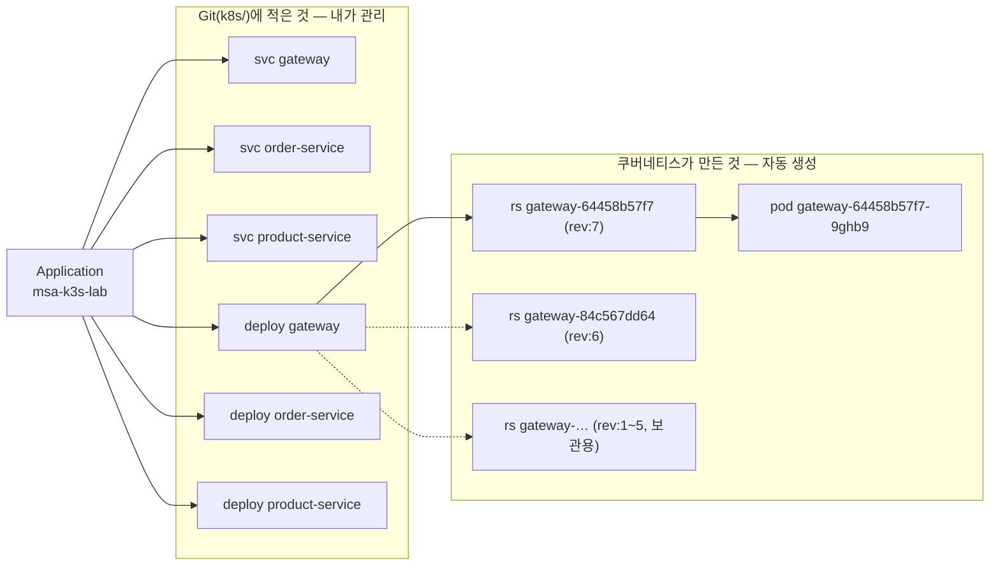
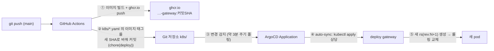

# ArgoCD 화면 읽는 법 — msa-k3s-lab 리소스 트리

ArgoCD UI에서 `msa-k3s-lab` Application을 열면 나오는 **리소스 트리**가 무엇을 의미하는지 설명합니다.
왼쪽에서 오른쪽으로 갈수록 "Git에 적은 선언"이 "실제로 도는 프로세스"로 구체화됩니다.

## 1. 트리의 전체 구조

| 노드 | 정체 | 누가 만들었나 |
|------|------|--------------|
| 맨 왼쪽 `msa-k3s-lab` | ArgoCD **Application** — "이 Git 저장소의 `k8s/` 폴더를 이 클러스터에 맞춰라"는 선언 하나 | 우리가 등록 (`k8s/argocd/`) |
| `svc` | **Service** — 파드들 앞의 고정 주소(내부 DNS 이름 + 로드밸런싱) | Git 매니페스트 |
| `deploy` | **Deployment** — "이 이미지를 replica 몇 개로 돌려라"는 선언 | Git 매니페스트 |
| `rs` | **ReplicaSet** — Deployment의 *한 버전*. 이미지 태그가 바뀔 때마다 새로 생김 | Deployment가 자동 생성 |
| `pod` | **Pod** — 실제로 돌고 있는 컨테이너(프로세스) | ReplicaSet이 자동 생성 |

핵심: **우리가 Git에 적는 것은 `svc`와 `deploy`까지**입니다. `rs`와 `pod`는 쿠버네티스가
Deployment 선언을 실현하려고 스스로 만드는 것들이라, Git에는 없지만 트리에는 보입니다.

## 2. 아이콘·배지 읽는 법

| 표시 | 의미 |
|------|------|
| 💚 초록 하트 | **Health = Healthy** — 리소스가 의도한 상태로 잘 돌고 있음 |
| ✅ 초록 체크 | **Sync = Synced** — 클러스터의 실제 상태가 Git 선언과 일치함 |
| `5 hours` / `15 minutes` | 그 리소스가 만들어진 뒤 경과한 시간 (age) |
| `rev:7` | Deployment의 **배포 이력 번호** — 7번째 버전이라는 뜻 (`deployment.kubernetes.io/revision`) |
| `running` `1/1` | Pod 상태 — 컨테이너 1개 중 1개 Ready. `0/1`이면 아직 준비 안 됨 |
| 파란색 카드 | 트리의 끝(leaf)인 실행 단위 = Pod 강조 표시 |
| 점선 화살표 | "왼쪽이 오른쪽을 소유/관리한다"는 관계 (ownerReference) |

하트와 체크는 **서로 다른 질문에 답합니다**:
- 체크(Sync)는 "Git과 같은가?" — 다르면 `OutOfSync`(노란 화살표)
- 하트(Health)는 "잘 돌아가는가?" — 기동 중이면 `Progressing`(파랑), 죽어가면 `Degraded`(빨강)

Git과 일치하지만(Synced) 파드가 죽는 중(Degraded)일 수도 있고, 잘 돌지만(Healthy)
Git이 더 최신(OutOfSync)일 수도 있습니다. 처음 설치 직후 앱 카드가 붉게 보였던 것은
파드들이 아직 뜨는 중이던 **일시적 Progressing/Missing** 상태였습니다 — 다 뜨면 초록으로 바뀝니다.

## 3. gateway 밑에 rs가 7개나 있는 이유

`deploy gateway` 아래 `rev:1`부터 `rev:7`까지 ReplicaSet이 줄줄이 보이는데, **살아있는 것은
최신(rev:7) 하나뿐**입니다 — 파드가 연결된 rs가 그것 하나라는 걸 트리에서 확인할 수 있습니다.

- 이미지 태그가 바뀔 때마다(= git push마다) Deployment는 **새 ReplicaSet을 만들어 갈아탑니다**.
  새 rs의 파드가 Ready가 되면 옛 rs의 파드를 줄이는 롤링 업데이트 방식입니다.
- 옛 ReplicaSet은 파드 0개 상태로 **보관**됩니다 — `kubectl rollout undo`로 즉시 롤백하기 위한
  이력입니다. 기본으로 최근 10개까지 보관합니다(`revisionHistoryLimit`).
- 그러니 "rs가 7개 = 지금까지 7번 배포했다"로 읽으면 됩니다. 각 rs의 age(`5 hours`,
  `31 minutes`, `15 minutes`…)가 곧 배포 시각의 흔적입니다.

## 4. 이 트리가 갱신되는 흐름 (GitOps)

이 Application에는 자동화 옵션이 켜져 있습니다:

| 옵션 | 의미 |
|------|------|
| `automated` | OutOfSync가 되면 사람이 Sync 버튼을 누르지 않아도 자동 반영 |
| `prune: true` | Git에서 매니페스트를 **지우면** 클러스터의 리소스도 지움 |
| `selfHeal: true` | 누가 클러스터를 **직접** 고치면(kubectl edit 등) Git 상태로 되돌림 |

즉 이 화면에서 초록 하트·체크가 유지된다는 것은 "**Git에 적힌 대로만 클러스터가 돈다**"는
뜻입니다. 손으로 바꾼 것은 selfHeal이 되돌리고, Git에서 지운 것은 prune이 치웁니다.

## 5. 화면에서 눌러볼 것들

| 동작 | 나오는 것 |
|------|-----------|
| pod 카드 클릭 → LOGS 탭 | 그 파드의 stdout 로그 (Grafana 없이도 즉석 확인) |
| pod 카드 클릭 → EVENTS 탭 | 스케줄링/이미지 pull/재시작 같은 쿠버네티스 이벤트 |
| deploy 카드의 ⋮ 메뉴 | Restart(파드 전부 재기동), 히스토리 확인 |
| 상단 History and Rollback | 배포 이력에서 이전 rev로 롤백 — 단, auto-sync가 켜져 있으면 곧 Git 상태로 되돌아가므로 **진짜 롤백은 Git revert**로 한다 |
| 상단 App Diff | Git 선언과 클러스터 실제 상태의 차이 (OutOfSync일 때 원인 확인) |

마지막 행이 GitOps의 요점입니다 — **화면은 관찰·진단용이고, 변경은 Git으로** 합니다.
