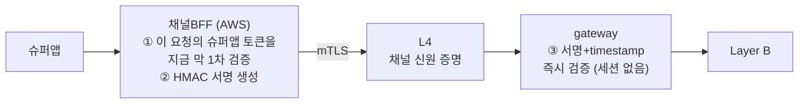
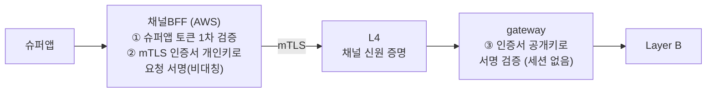
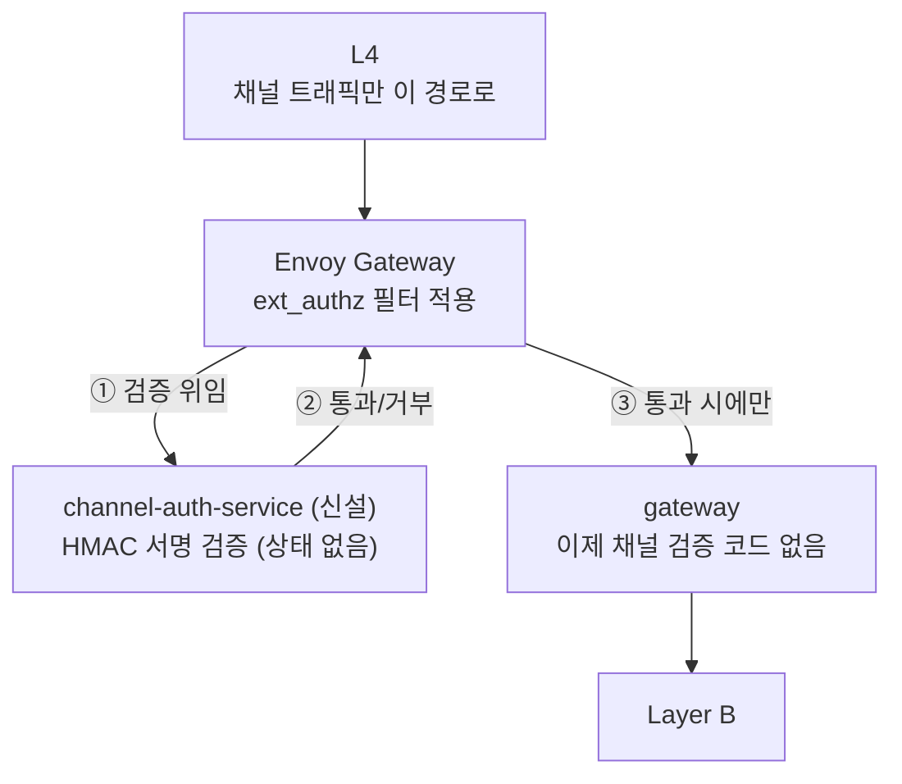
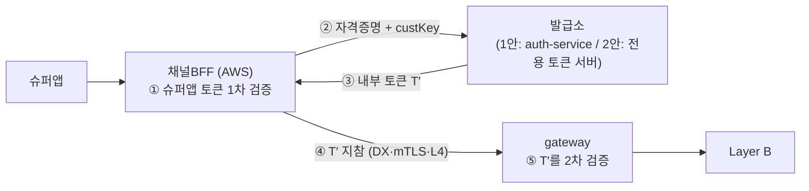
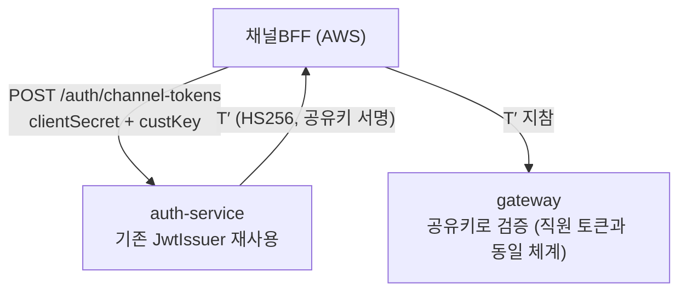
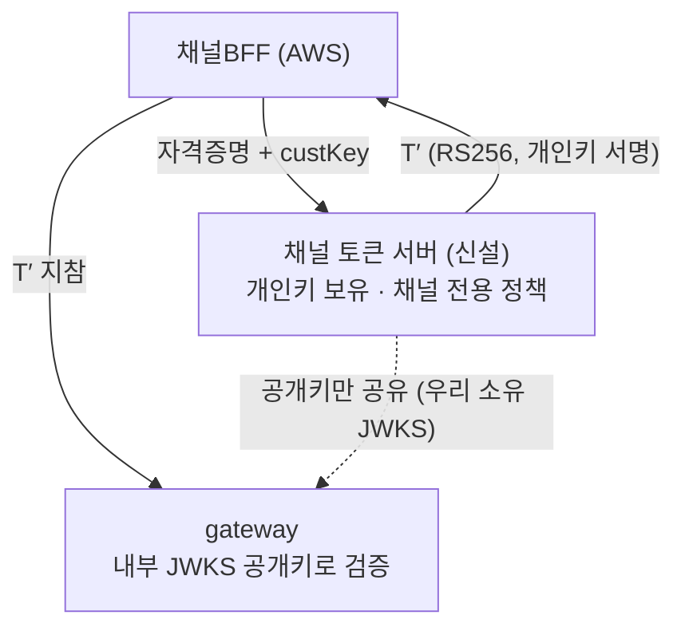
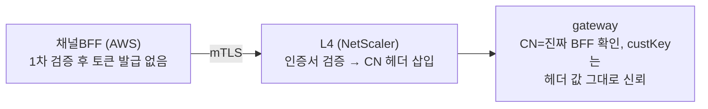
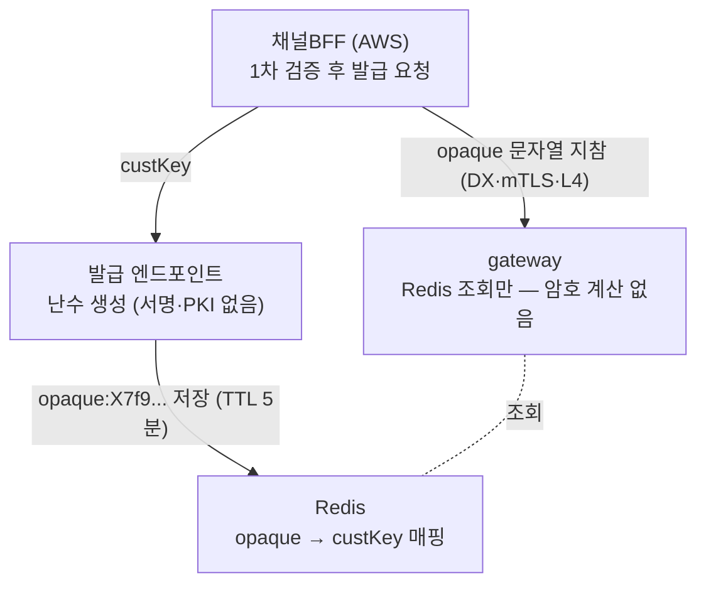

# 채널 인증 방식 — 최종 결정과 검토 과정

## 최종 결정 v1 (2026-08-24) — 세션 없는 요청 단위 HMAC 서명 〔대칭키〕

> **v2로 갱신됨 — 아래 "최종 결정 v2" 참고.** 이 v1은 대체된 게 아니라 **기준선(베이스라인)으로
> 보존**한다. "세션을 두지 않는다"는 핵심 방향은 v1과 v2가 동일하고, 차이는 요청 서명에
> 대칭키(HMAC)를 쓰느냐 비대칭키(mTLS 인증서 재사용)를 쓰느냐뿐이다. 구현 난이도가
> 낮다는 v1의 장점이 여전히 유효해, 상황에 따라 v1을 그대로 채택할 수도 있다.

핵심 제약이 뒤늦게 확인됐다: **슈퍼앱의 로그인·로그아웃을 우리 쪽에서 감지할 방법이
없다.** 통지(웹훅) 채널이 없고, 우리가 관찰할 수 있는 건 "미니앱이 유효한 슈퍼앱 토큰을
들고 API를 호출했다"는 사실뿐이다.

이 제약을 확인하고 나니, 아래 1~8안이 전부 전제로 깔았던 것 — **"우리 내부에 로그인
상태(세션)를 만들어 얼마간 유지한다"** — 이 자체가 잘못된 목표였다는 게 드러났다. 세션을
아무리 정교하게 설계해도 슈퍼앱의 진짜 로그인 상태를 반영하지 못하는 TTL짜리 근사치일
뿐이고, 로그아웃 시 그 근사치를 무효화할 신호조차 받을 수 없다.

**그래서 세션 개념 자체를 버렸다.** 채널BFF는 어차피 매 요청마다 슈퍼앱 토큰을 새로
검증한다(1차 검증) — 그 검증 결과를 그 요청 하나를 인증하는 근거로 즉시 써버리고,
발급 서버도 세션 저장소도 두지 않는다.



- **세션·토큰이 존재하지 않는다** — 저장할 것도, 폐기할 것도, 만료를 관리할 것도 없다.
- **"로그아웃"은 별도 처리가 필요 없다** — 다음 요청 때 ①(슈퍼앱 토큰 검증)이 자연히
  실패하면 그걸로 끝. 감지·통지·연동이 애초에 필요 없다.
- **mTLS(채널 증명)와 HMAC(요청 증명)이 서로 다른 비밀에 의존** — 하나가 뚫려도 나머지가
  버틴다. L4~gateway 구간이 침해돼도 HMAC 공유 비밀 없이는 위조 불가.
- **Redis는 완전히 다른(가벼운) 용도로만** — "이 서명값을 몇 초 전에 이미 봤나"(재전송
  방지)만 짧게 캐시. 세션 저장이 아니라 자기 청소되는 초경량 캐시다.

### 소스 구조 (기존 컨벤션 그대로, 새 서비스 없음)

```kotlin
// BFF 쪽 (Spring Boot, AWS) — 요청마다 서명 생성
@Component
class ChannelRequestSigner(private val signingProps: ChannelSigningProperties) {
    fun sign(method: String, path: String, custKey: String): SignedRequestHeaders {
        val timestamp = Instant.now().epochSecond.toString()
        val nonce = UUID.randomUUID().toString()
        val payload = listOf(method, path, timestamp, nonce, custKey).joinToString("\n")
        return SignedRequestHeaders(hmacSha256(signingProps.secret, payload), timestamp, nonce, custKey)
    }
}
```

```kotlin
// gateway 쪽 (IDC) — 요청마다 서명 검증, 세션 조회 없음
@Component
class ChannelRequestVerifier(
    private val signingProps: ChannelSigningProperties,
    private val redisTemplate: StringRedisTemplate,   // 재전송 방지 캐시 — 세션 저장 아님
) {
    fun verify(request: ChannelSignedRequest): Boolean {
        val withinWindow = abs(Instant.now().epochSecond - request.timestamp) <= 60
        if (!withinWindow) return false

        val firstSeen = redisTemplate.opsForValue()
            .setIfAbsent("channel-nonce:${request.nonce}", "1", Duration.ofMinutes(5)) ?: false
        if (!firstSeen) return false   // 재전송된 요청

        val payload = listOf(request.method, request.path, request.timestamp, request.nonce, request.custKey).joinToString("\n")
        val expected = hmacSha256(signingProps.secret, payload)
        return MessageDigest.isEqual(expected.toByteArray(), request.signature.toByteArray())
    }
}
```

- 공유 비밀(`signingProps.secret`)은 신규 테이블·서비스 없이 k8s Secret / AWS Secrets
  Manager로만 배포·회전한다[^secrets-manager].
- 직원 인증(JWT, auth-service 발급)은 그대로 유지 — 이 결정은 **채널(슈퍼앱) 인증에만**
  적용된다.

[^secrets-manager]: **AWS Secrets Manager란?** 설치하는 소프트웨어가 아니라 AWS가 이미
    운영하는 관리형 비밀 보관 API 서비스다(S3·RDS와 같은 부류) — 우리는 서버를 두지
    않고, 콘솔이나 `aws secretsmanager create-secret`으로 값을 등록하기만 하면 된다.
    k8s Secret과 비교하면: k8s Secret은 우리 클러스터의 etcd에 저장되는 오브젝트(우리가
    관리), Secrets Manager는 AWS 리전에서 AWS가 가용성·암호화·접근 감사(CloudTrail)를
    대신 맡아주는 서비스(비밀 1개당 월 $0.40 안팎)다.
    **배포 절차**: ① `openssl rand -base64 32`로 공유 비밀 값 하나를 생성 → ② 같은 값을
    AWS Secrets Manager와 k8s Secret 양쪽에 등록 → ③ ECS Fargate 태스크 정의의
    `secrets` 필드, k8s Deployment의 `envFrom`에 각각 연결해두면 컨테이너가 뜰 때
    **환경변수로 자동 주입**된다 — 코드에서 SDK를 직접 호출할 필요가 없다.
    **"회전"의 실제 의미**: Secrets Manager의 자동 회전 기능은 RDS 비밀번호처럼 한쪽만
    바꾸면 되는 경우를 위한 것이라, 양쪽(BFF·gateway)이 동시에 같은 값을 알아야 하는 이
    공유 비밀에는 그대로 못 쓴다. 실제로는 mTLS 인증서 롤오버와 같은 원리 — 새 값을
    양쪽에 먼저 추가하고, gateway가 신·구 값을 잠시 함께 허용하는 겹침 기간을 둔 뒤,
    BFF를 새 값으로 전환하고, 그 다음에 구 값을 지운다.
    **대안**: 자동 회전 Lambda 연동을 못 쓰는 만큼, 값 하나만 안전히 보관할 목적이면
    **AWS Systems Manager Parameter Store(SecureString)**가 기능상 충분하고 비용은
    무료(일반 사용량 기준)다 — 다만 AWS 운영팀이 이미 Secrets Manager를 표준으로 쓰고
    있다면 그쪽을 따르는 게 운영 일관성 면에서 낫다.

### 이전 안들과 비교하면 무엇이 달라졌나

| | 세션 기반(1·2·3·8안) | **세션 없는 요청 서명 (최종)** |
|---|---|---|
| "로그인 상태" 저장 | 발급소 또는 Redis에 저장 | **저장 안 함 — 매번 새로 증명** |
| "로그아웃" 처리 | 폐기 로직 필요(감지 불가로 실은 구현 불가) | **처리할 게 없음** |
| 지연된 근사치 유효기간 | 있음(슈퍼앱은 로그아웃했는데 우리만 몇 분 더 살아있는 창) | **없음 — 매 요청이 그 순간의 진실** |
| 새 인프라 | 발급 서버(2안) 또는 세션 저장소(8안) | **없음** |
| 네트워크 왕복 | 교환 왕복(1·2안) 또는 Redis 조회(8안) | **0회** — 로컬 CPU 연산 |
| 내부 침투 방어 | mTLS만 | **mTLS + HMAC 비밀 이중** |

---

## 최종 결정 v2 (2026-08-25) — mTLS 인증서 키 재사용 서명 〔비대칭키, 권장〕

**v1의 남은 약점**: HMAC은 대칭키라 채널BFF와 gateway가 **같은 비밀 값**을 나눠 갖는다.
그 값 하나가 유출되면 유출시킨 쪽이 어디든 상관없이 임의의 고객 요청을 완벽하게 위조할
수 있다. 세션이 없어 "이 세션만 무효화"도 못 하고, 대응은 비밀을 통째로 교체하는 것뿐 —
그 교체가 완료될 때까지는 위조 요청과 진짜 요청을 구분할 방법이 없다.

**핵심 아이디어**: 새 비밀을 하나 더 만들지 말고, **이미 있는 mTLS 클라이언트 인증서의
키 쌍을 요청 서명에도 재사용**한다. 채널BFF는 mTLS 핸드셰이크를 하려면 어차피 개인키를
로컬에 들고 있다 — 그 같은 개인키로 요청에 서명하면 되고, gateway는 그 인증서의
**공개키만** 알면 검증할 수 있다. 이 공개키는 우리가 직접 발급·관리하는 CA의 것이라
슈퍼앱 JWKS처럼 타사에 의존하는 문제도 아니다.



이게 나아지는 이유:

| | v1: HMAC 공유 비밀(대칭) | **v2: mTLS 키 재사용(비대칭)** |
|---|---|---|
| gateway가 들고 있는 값 | **위조에 쓸 수 있는** 비밀 그 자체 | 공개키뿐 — 유출돼도 위조 불가 |
| 유출 시 파급 | 전체 채널 즉시 위조 가능 | **위조 불가** — 개인키는 여전히 BFF에만 있음 |
| 새로 만들어야 할 것 | 별도 비밀 생성·배포·회전 절차 | **없음** — 기존 mTLS 인증서 수명주기에 얹힘 |
| 회전 절차 | 새로 협의 필요(비밀 교환·주기) | mTLS 인증서 교체할 때 자동으로 같이 됨 |
| 표준 근거 | 사내 자체 규격 | **IETF 표준(RFC 9421, HTTP Message Signatures)** |
| 구현 난이도 | 낮음(HMAC 라이브러리 한 줄) | 중간(비대칭 서명 API 사용, 트래픽 규모에서 성능 차이는 무의미) |

### 소스 구조 (v1과 거의 동일, 서명 알고리즘만 교체)

```kotlin
// 채널BFF 쪽 — 기존 mTLS 키스토어의 개인키를 그대로 재사용
@Component
class ChannelRequestSignerV2(private val mtlsKeyStore: KeyStore) {
    private val privateKey = mtlsKeyStore.getKey("channel-client-cert", password) as PrivateKey

    fun sign(method: String, path: String, custKey: String): SignedRequestHeaders {
        val timestamp = Instant.now().epochSecond.toString()
        val nonce = UUID.randomUUID().toString()
        val payload = listOf(method, path, timestamp, nonce, custKey).joinToString("\n")
        val sig = Signature.getInstance("SHA256withRSA").apply {
            initSign(privateKey)
            update(payload.toByteArray())
        }
        val signature = Base64.getEncoder().encodeToString(sig.sign())
        return SignedRequestHeaders(signature, timestamp, nonce, custKey)
    }
}
```

```kotlin
// gateway 쪽 — 채널BFF 인증서의 공개키(CA로 이미 관리 중)로 검증
@Component
class ChannelRequestVerifierV2(
    private val trustedClientCert: X509Certificate,
    private val redisTemplate: StringRedisTemplate,   // 재전송 방지 캐시 — v1과 동일
) {
    fun verify(request: ChannelSignedRequest): Boolean {
        val withinWindow = abs(Instant.now().epochSecond - request.timestamp) <= 60
        if (!withinWindow) return false

        val firstSeen = redisTemplate.opsForValue()
            .setIfAbsent("channel-nonce:${request.nonce}", "1", Duration.ofMinutes(5)) ?: false
        if (!firstSeen) return false

        val payload = listOf(request.method, request.path, request.timestamp,
                              request.nonce, request.custKey).joinToString("\n")
        val sig = Signature.getInstance("SHA256withRSA").apply {
            initVerify(trustedClientCert.publicKey)
            update(payload.toByteArray())
        }
        return sig.verify(Base64.getDecoder().decode(request.signature))
    }
}
```

- 재전송 방지(timestamp+nonce, Redis 캐시)는 v1과 동일 — 바뀌는 건 서명·검증 알고리즘뿐.
- **v1의 "AWS Secrets Manager / k8s Secret 공유 비밀" 절차가 통째로 필요 없어진다** — 별도
  비밀을 안 만드므로 배포·회전 협의 항목 자체가 사라진다. 대신 mTLS 인증서 발급·교체
  절차("mTLS 검토안" 탭)를 그대로 따른다.
- 대가: gateway가 채널BFF 인증서의 공개키(또는 그 CA)를 신뢰 설정으로 갖고 있어야 한다 —
  이는 L4가 이미 하고 있는 CN 추출·검증과 같은 신뢰 체계의 연장이라 새로운 개념은 아니다.

### 언제 v1, 언제 v2

- **v2 권장** — 지금처럼 실제 도입을 앞두고 있고, "비밀 유출 = 즉시 전체 위조"라는 리스크를
  피하고 싶을 때. 구현 비용 증가가 크지 않다.
- **v1도 유효** — 프로토타입·PoC 단계처럼 구현 속도가 더 중요하거나, mTLS 인증서 발급
  체계가 아직 안 갖춰진 환경에 먼저 적용해볼 때.

---

## 추가 검토 — IDC에 전용 채널 인증 서비스를 둘 것인가 (배치 문제)

**주의: 이것은 인증 방식(세션 없는 요청 서명 — v1/v2 어느 쪽이든)을 바꾸는 게 아니다.** 위 결정은 그대로
두고, "그 서명 검증 로직을 **어디에** 둘 것인가"라는 완전히 별개의 질문을 다룬다 —
gateway 코드 안에 넣을지(A), IDC에 새 서비스를 하나 올려 그 서비스가 전담하게 할지(B).

### 왜 다시 "새 서비스"를 고려하나

지금 결정은 gateway 코드 안에 "직원 요청이면 JWT, 채널 요청이면 HMAC"으로 분기하는
로직을 넣는 것이었다. 그런데 이건 정확히 **auth-service에서 방금 없앤 결합**을 gateway
안에서 재현하는 셈이다 — 직원 인증과 채널 인증이 같은 배포 단위 안에 공존한다. 채널이
슈퍼앱 하나뿐인 지금은 문제가 작지만, 아래 상황에서 재검토할 가치가 생긴다.

- 제휴 채널이 늘어(슈퍼앱 외 다른 파트너 추가) gateway의 채널 검증 로직이 계속 불어날 때
- 보안팀이 채널 트래픽만의 이상 탐지·rate limit·감사를 gateway 전체 로그와 분리해서
  보고 싶을 때
- 채널 인증 로직의 배포·장애가 직원 로그인에 전혀 영향을 주지 않도록 완전히 격리하고 싶을 때

### 안 B — 전용 서비스 `channel-auth-service` (Envoy `ext_authz` 배치)

새 서비스를 만들되, **토큰을 발급하지 않는다** — 이 점이 예전 2안(전용 토큰 서버)과
결정적으로 다르다. 이 서비스는 순수하게 "이 서명이 유효한가?"만 판정하는 상태 없는
검증 함수다.



**핵심 배치 방식 — Envoy `ext_authz`**: Envoy Gateway에는 "요청을 라우팅하기 전에 외부
서비스에 먼저 물어보고, 거부하면 라우팅 자체를 안 한다"는 표준 필터(`ext_authz`)가 있다.
채널 VIP로 들어온 요청만 이 필터가 `channel-auth-service`를 호출하도록 설정하면:

- **gateway 코드에서 채널 인증 로직이 완전히 사라진다** — gateway는 이제 "이 요청이
  여기까지 왔다면 이미 검증된 것"만 알면 되고, 직원 JWT 검증만 남는다.
- **인증 경계는 여전히 하나다** — "Envoy + channel-auth-service" 조합이 그 경계 역할을
  대신할 뿐, 검증되지 않은 요청이 gateway/Layer B까지 도달하는 건 똑같이 불가능하다.
- 이 서비스와 gateway 사이 구간(Envoy 뒤)은 여전히 폐쇄망이므로, NetworkPolicy로 "이
  경로는 ext_authz를 통과한 트래픽만"을 강제하는 게 L4의 헤더 스푸핑 방지와 같은 원리로
  필요하다.

### 비교 — 안 A(인라인) vs 안 B(전용 서비스)

| | **A: gateway 인라인 (현재 채택)** | B: 전용 서비스 분리 |
|---|---|---|
| 새 배포 대상 | 없음 | +1 (`channel-auth-service`) |
| 코드 결합 | 직원+채널 로직이 같은 코드베이스 | 완전 분리 |
| 지연 | 0 — 로컬 함수 호출 | ext_authz 홉 1개 추가(수 ms, gRPC면 더 짧음) — 캐싱으로 더 줄일 수 있음 |
| 장애 영향 범위 | gateway 장애 = 직원·채널 둘 다 영향(기존과 동일) | 이 서비스 장애 = 채널만 영향, 직원 로그인은 무관 |
| 감사·정책 독립성 | 낮음 — 같은 로그 스트림 | 높음 — 채널 전용 로그·rate limit·이상탐지를 독립적으로 운영 |
| 세션 여부 | 없음(동일) | **없음(동일)** — 상태 없는 검증 함수, Redis는 nonce dedup만 그대로 |
| BFF에게 보이는 차이 | 없음 | **없음** — BFF는 여전히 HMAC 서명만 만들 뿐, 누가 검증하는지 몰라도 된다 |
| 적합 시점 | 채널 1개, 지금 규모 | 채널이 여럿으로 늘거나 감사·격리 요건이 강해질 때 |

마지막 두 줄이 이 설계의 좋은 특성이다 — **어느 쪽을 택하든 BFF의 서명 생성 방식은 전혀
바뀌지 않는다.** "누가 검증하느냐"는 순전히 IDC 내부 배치 문제라서, A로 시작했다가 필요할
때 B로 옮겨도 채널BFF(AWS) 쪽 코드는 한 줄도 안 바뀐다 — Envoy 설정과 gateway 코드 정리만
하면 된다.

### 권장

**지금은 A(gateway 인라인)를 유지한다.** 채널이 하나뿐이고 팀 규모가 작은 지금은 새
배포 대상을 늘릴 실익이 크지 않다. 다만 이 결정은 **가역적**이다 — 이 문서에 배치를
바꿀 조건(채널 확장, 감사 요건 강화, 장애 격리 필요)을 남겨두는 이유가 그것이다. 조건이
충족되면 B로 이관하되, 이관 비용은 Envoy `ext_authz` 설정 + gateway의 채널 분기 코드
제거뿐 — 인증 방식(HMAC 서명) 자체나 BFF 쪽은 그대로 유지된다.

---

## 검토 과정 (참고 기록)

아래는 최종 결정에 이르기까지 검토했던 안들이다. 1·2·3·8안은 모두 "세션을 만들어
유지한다"를 전제로 했는데, 슈퍼앱 로그인·로그아웃 감지가 애초에 불가능하다는 게 확인되며
그 전제가 무너져 폐기됐다. 6·7안(무토큰/HMAC)은 방향은 맞았으나 세션 개념과 결합해
검토했던 것을, 위 최종안에서 "세션 없음"을 명시적 설계 원칙으로 승격시켰다.

전제(당시): 슈퍼앱 JWKS로 gateway가 직접 2차 검증하는 방식은 채택하지 않는다(타사 kid에
내부 인증 경계를 의존시키지 않기 위함). 채널BFF(AWS)가 슈퍼앱 토큰을 1차 검증한 뒤, IDC 안에서
**우리가 발급하는 내부 토큰**으로 갈아끼워 gateway가 2차 검증한다. 두 안 모두 이 전제
위에서, "누가·어디서 그 내부 토큰을 발급하느냐"만 다르다.

## 공통 흐름 (두 안 동일)



- 슈퍼앱 토큰(T)은 ①에서 검증되고 **폐기**된다 — ②부터는 내부 토큰(T′)만 존재.
- ④ 구간은 mTLS(옵션 ①)로 채널 자체를 증명 — "누가 이 요청을 보냈나"의 별도 층.
- 두 안의 차이는 **③의 발급소가 어디이고 무슨 키를 쓰는가** 하나뿐이다.

---

## 1안 — auth-service 확장 (교환 엔드포인트 추가)

기존 직원 토큰 발급 체계(`auth-service`의 `auth` subdomain)에 채널 교환 엔드포인트 하나를
얹는다. 새 서비스를 만들지 않는다.



### 소스 구조

```
auth-service/api/.../auth/
├── auth/  mfa/  rbac/          ← 기존
└── exchange/                    ← 신설 subdomain
    ├── controller/ChannelTokenController.kt
    ├── service/ChannelTokenService.kt
    └── dto/ChannelTokenDtos.kt
```

- 발급기는 기존 `JwtIssuer`(HS256, gateway와 공유키) 재사용 — claim만 `principalType=CUSTOMER`로 다르게.
- 클라이언트 자격증명(clientSecret)은 신규 테이블 없이 k8s Secret(`bank-shared-secret.CHANNEL_BFF_CLIENT_SECRET`)으로 — 클라이언트가 채널BFF 하나뿐이라 성립하는 단순화.
- gateway는 iss/aud + `principalType`으로 직원/채널 토큰을 분기 — 검증 키는 **하나(공유키)**.

### 장점
- 새 인프라 없음 — 배포·운영 대상이 늘지 않는다.
- 기존 직원 토큰 파이프라인을 그대로 재사용해 구현·검증 비용이 가장 낮다.

### 단점
- 직원 인증과 채널 인증이 **같은 서비스, 같은 키**를 공유 — 장애·보안 사고가 서로에게 전이될 여지.
- 대칭키(HS256)라 발급 능력이 곧 검증 능력 — gateway가 침해되면 이론상 채널 토큰도 위조 가능(직원 토큰과 동일한 기존 리스크이긴 함).
- 채널이 여러 개로 늘면(제휴사 추가 등) auth-service 하나에 계속 얹혀 책임이 비대해짐.

---

## 2안 — 전용 채널 토큰 서버 신설

채널 인증만 전담하는 새 서비스(또는 auth-service 내 완전히 분리된 subdomain)를 두고,
**비대칭키(RS256)** 로 발급 — gateway는 공개키만 가지면 검증할 수 있다.



### 소스 구조 (신규 서비스 또는 auth-service 내 격리 subdomain)

```
channel-auth-service/api/.../channelauth/
├── token/
│   ├── controller/ChannelTokenController.kt
│   ├── service/ChannelTokenIssueService.kt     RS256 서명, 개인키는 이 서비스만 보유
│   └── domain/ChannelClient.kt                  등록된 채널 클라이언트(BFF 등)
└── jwks/
    └── controller/JwksController.kt             GET /.well-known/jwks.json — 우리 공개키 노출
```

- `tools/service-template/create-service.sh`로 뼈대 생성 — 표준 구조(controller/service/domain) 그대로.
- gateway는 이 서비스의 `/.well-known/jwks.json`을 캐시해 검증(원리는 슈퍼앱 JWKS 캐싱과 동일하되, **발급자가 우리**라는 게 핵심 차이).
- 채널이 늘어나면(제휴사 B, C…) 이 서비스 하나에 클라이언트를 등록만 추가 — auth-service는 손대지 않음.

### 장점
- **직원 인증과 완전 분리** — 이 서비스 장애·침해가 직원 로그인에 전이되지 않음(그 반대도).
- 비대칭키라 gateway(검증자)가 뚫려도 발급 능력까지 얻지는 못함 — 개인키는 이 서버에만.
- 채널별 정책(토큰 수명, 스코프, rate limit)을 auth-service 정책과 독립적으로 조정 가능.
- 감사 관점에서 "채널 발급 이력"이 auth-service 로그와 섞이지 않고 명확히 분리됨.
- 향후 다른 채널(제휴사)이 늘어도 구조 변경 없이 클라이언트 등록만으로 확장.

### 단점
- 서비스 +1 — 배포·모니터링·이중화 대상이 하나 늘어난다.
- 초기 구현 비용이 1안보다 큼(JWKS 엔드포인트, 키 페어 관리·롤오버 별도 필요).
- 소규모(채널 1개)인 지금 시점엔 다소 과할 수 있음.

---

## JWT 밖의 대안 — 6·7·8안

1~4안은 전부 "토큰에 어떻게 서명하느냐"의 변주였다. 축을 완전히 바꾼 대안 세 가지를
추가로 검토한다.

## 6안 — 무토큰, 채널 자체가 신원 (Perimeter-only)

mTLS가 이미 "이 회선을 탄 건 진짜 BFF"를 증명한다면, 그 위에 또 다른 신원 증명(토큰)을
얹을 필요가 있는지 되묻는 방식. 토큰·서명·발급 서버가 전부 없다.



- **논리**: TLS는 전송 중 위변조를 막고(무결성), mTLS는 그 회선을 탄 게 진짜 BFF임을
  증명한다. NetworkPolicy로 "이 gateway 경로는 L4(mTLS VIP)를 거친 트래픽만"을 강제하면,
  이 헤더는 BFF가 아니면 애초에 만들어낼 수 없는 값이 된다.
- **장점**: 구현 난이도 최저 — 암호학 코드 0줄. 새 서비스·인프라 없음.
- **단점**: 토큰이 없어 폐기·만료 개념 자체가 없다(매 요청이 독립적으로 채널 인증만
  받음). 감사 추적성이 약함 — 토큰 ID로 요청을 세션에 엮을 수 없고 custKey만 남는다.
  L4~gateway 구간 신뢰가 방어의 전부라, 그 구간이 뚫리면 추가 방어선이 없다.

## 7안 — 대칭키 요청 서명 (HMAC, PKI 없음)

4안(mTLS+서명)의 "발급서버 없음" 장점은 유지하고 PKI(개인키·인증서 관리) 복잡도는 뺀
버전. AWS SigV4와 같은 원리다.

```
BFF·gateway가 공유 비밀(shared secret) 하나를 k8s Secret / Secrets Manager로 보유
BFF: signature = HMAC-SHA256(secret, method + path + timestamp + nonce + custKey)
     → 헤더로 전송: X-Signature, X-Timestamp, X-Nonce, X-CustKey
gateway: 같은 계산 반복 → 서명 일치 + timestamp 60초 이내 + nonce 최근 미사용(Redis) 확인
```

- **장점**: 개인키·인증서·발급 서버 전부 불필요 — 비밀 하나만 양쪽이 공유. timestamp+nonce
  덕분에 탈취한 요청을 그대로 재전송해도 막힌다(재전송 방지). 매 요청마다 서명 값이
  달라져 헤더가 유출돼도 재사용이 안 된다(5안 고정 API 키와의 결정적 차이).
- **단점**: 표준 JWT 라이브러리를 못 쓰고 서명 규격을 직접 구현·검증해야 한다(버그 나면
  보안구멍). 공유 비밀 하나가 유출되면 양쪽 다 위험해 회전 절차가 필요하다.

## 8안 — Opaque 세션 토큰 + Redis 조회 (신원 = 상태 조회)

이 아키텍처와 궁합이 가장 좋은 방식. 랩에서 이미 검증한 **jti 폐기 목록과 원리가 완전히
같다** — "폐기 목록"을 "존재 자체가 인증"으로 한 단계 더 쓰는 것뿐이다.



- **동작**: opaque 토큰은 JWT처럼 안에 정보를 담지 않는다. 그냥 무작위 문자열
  (`X7f9k2...`). 발급 시 `{그 문자열: custKey}`를 Redis에 TTL과 함께 저장하고, gateway는
  요청마다 서명 검증이 아니라 **Redis 조회**를 한다 — "이 문자열 알아?"
- **왜 이 아키텍처에 특히 잘 맞는지**:

  | 항목 | 내용 |
  |---|---|
  | 새 인프라 | 없음 — Redis는 이미 클러스터 안(Sentinel HA)에 있고, jti 폐기 목록과 같은 용도로 쓰던 걸 재사용 |
  | 새 서비스 | 발급 엔드포인트는 기존 auth-service 또는 gateway 자신에 붙이는 얇은 코드 |
  | 암호학 코드 | 0줄 — `SecureRandom` 문자열 생성 + Redis SET/GET이 전부 |
  | 즉시 폐기 | 최강 — 로그아웃 즉시 Redis 키 하나만 삭제하면 끝. JWT는 만료를 기다리거나 별도 폐기 목록이 필요했는데, 여긴 "존재 = 유효"라 폐기가 자연스럽다 |
  | 감사 | 발급 시점에 로그를 남기면 JWT 방식과 동일한 감사 확보 |

- **대가**: gateway의 모든 요청이 Redis 조회 1회에 의존한다 — Redis가 죽으면 인증 전체가
  막힌다(fail-closed). 이미 Sentinel 3노드 HA로 마스터 장애 시 자동 승격되므로 위험은
  "완전 장애" 시나리오로 한정된다. gateway 파드가 여러 개여도 문제없다 — 데이터가
  Redis(공유)에 있지 로컬 메모리가 아니기 때문이다.

---

## 비교 요약 — 전체 7안

| | 1안 교환(대칭) | 2안 전용서버(비대칭) | 3안 BFF자체서명 | 4안 mTLS+서명 | 6안 무토큰 | 7안 HMAC서명 | **8안 Opaque+Redis** |
|---|---|---|---|---|---|---|---|
| 새 서비스 | 없음 | +1 | 없음 | 없음 | 없음 | 없음 | 없음(얇은 엔드포인트만) |
| 새 인프라 | 없음 | 없음 | 없음 | 없음 | 없음 | 없음 | **없음(기존 Redis 재사용)** |
| 암호학 복잡도 | 중(JWT) | 고(PKI) | 중(JWT) | 고(PKI+서명) | **0** | 중(HMAC) | **0** |
| 즉시 폐기 | 어려움(만료까지) | 어려움 | 어려움 | 해당없음 | 해당없음 | 해당없음 | **즉시(키 삭제)** |
| 감사 추적 | ○ | ○ | △ | △(요청로그) | 약함 | ○ | ○ |
| 단일 장애점 | auth-service | 전용서버 | 없음 | 없음 | 없음 | 없음 | **Redis 의존** |
| 구현 난이도 | 낮음 | 중간 | 낮음 | 높음 | **최저** | 중간 | **최저** |
| 적합한 시점 | 채널 1개, JWT 표준 유지 원할 때 | 채널 여럿·감사 격리 강할 때 | (비추천) | 고위험 API 보완용 | 극단적 단순화, 감사 요건 낮을 때 | 대칭키 재전송 방지가 필요할 때 | **신규 인프라 최소화 + 즉시 폐기가 중요할 때** |

## (검토 당시의 추천 — 상단 최종 결정으로 대체됨)

> 아래는 "슈�어앱 로그인·로그아웃 감지 불가" 제약이 확인되기 전에 내렸던 추천이다.
> 8안(Opaque+Redis)이 세션 기반 안 중에는 가장 나은 선택이라고 판단했었지만, 세션이라는
> 접근 자체가 이 제약 위에서는 성립하지 않는다는 게 이후 드러나 최종 결정(문서 상단)으로
> 대체됐다. 역사적 기록으로 남긴다.

이 프로젝트가 이미 갖고 있는 것(Redis Sentinel HA, jti 폐기 패턴을 랩에서 검증 완료,
"신규 인프라 최소화" 성향)을 기준으로 보면 8안이 가장 이 아키텍처의 결에 맞았다 —
새 서비스도, PKI도, JWT 라이브러리도 없이 기존 Redis 위에 조회 로직 하나 얹는 정도이고,
즉시 폐기라는 실질적 보안 이득까지 덤으로 얻는다고 봤다.

- 6안은 극단적으로 단순하지만 감사 근거가 약해 금융권 규제 대응에서 방어하기 어려울
  수 있다고 봤다.
- 1·2안(토큰 교환)은 "JWT 표준을 그대로 유지하고 싶다"는 요구가 있을 때 유효하다고 봤다.

## 공통 보안 대응 (두 안 모두 적용)

같은 토큰 방식의 구조적 대가 — **슈퍼앱 서명의 종단 검증이 채널BFF까지**라는 신뢰 이동은
어느 안을 택해도 동일하다. 그래서 아래는 안과 무관하게 반드시 갖춘다.

| 대응 | 내용 |
|---|---|
| mTLS 결합 | 발급 요청·API 호출 모두 "진짜 채널BFF"만 회선을 탈 수 있게(옵션 ①) |
| 클라이언트 자격증명 | 토큰만으로는 교환 불가 — 상수시간 비교로 검증 |
| 내부 토큰 짧은 수명 | 수 분 — 유출 시 피해 창 최소화 |
| 발급 감사 로그 | custKey별 발급 이력 — 이상 패턴 탐지, 침해 시 클라이언트 즉시 차단 |
| 스코프 제한 | 채널 토큰은 `principalType=CUSTOMER` 고정 — 직원 전용 API 접근 차단 |

## 검토했으나 채택하지 않은 변형

- **로그인 시점 선발급** — 슈퍼앱 로그인 때 미리 내부 토큰을 발급해 BFF가 세션 동안
  들고 있는 방식. 토큰 수명이 길어져 로그아웃 즉시 무효화가 필수가 되고(슈퍼앱 측 로그아웃
  이벤트 연동 신규 필요), BFF가 무상태를 포기해야 함(공유 세션 스토어 필요). 실익(교환
  왕복 절감)은 "첫 요청 시 교환 + custKey별 캐시"로 이미 달성 가능해 채택하지 않음.
- **BFF 자체 서명** — 서명키를 BFF(AWS)에 두고 발급 서버 없이 직접 서명. 왕복이 없어
  단순하지만 서명키가 우리 통제 밖(AWS)에 상주하고 중앙 발급 기록이 없어 감사에 약함.
- **mTLS + 요청 서명만 (토큰 없음)** — 매 요청을 서명해 재사용 공격에 구조적으로
  강하지만, JWT 표준 도구를 못 쓰고 서명 규격을 직접 구현해야 해 초기 비용이 큼. 고위험
  API(이체 등)에 한해 1·2안 위에 추가 결합하는 것은 유효한 보완책으로 남겨둔다.
- **고정 API 키** — 장수명 비밀 하나에 전부 의존해 유출 시 무방비, 요청·고객 단위 증명
  부재, 감사 근거 빈약 — 금융권 심사 지적 1순위 유형이라 제외.
