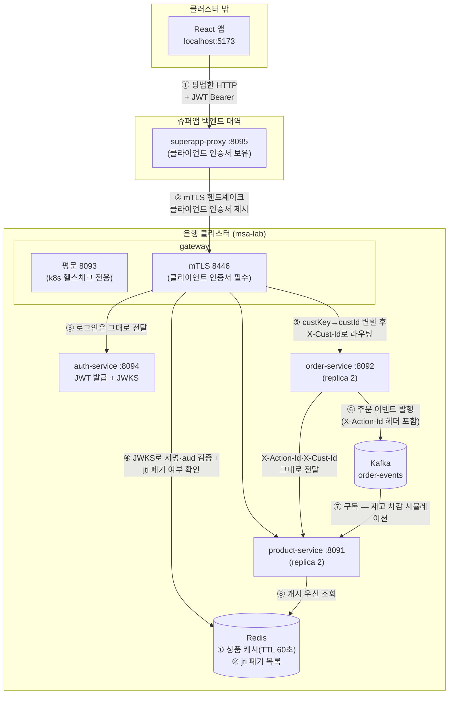
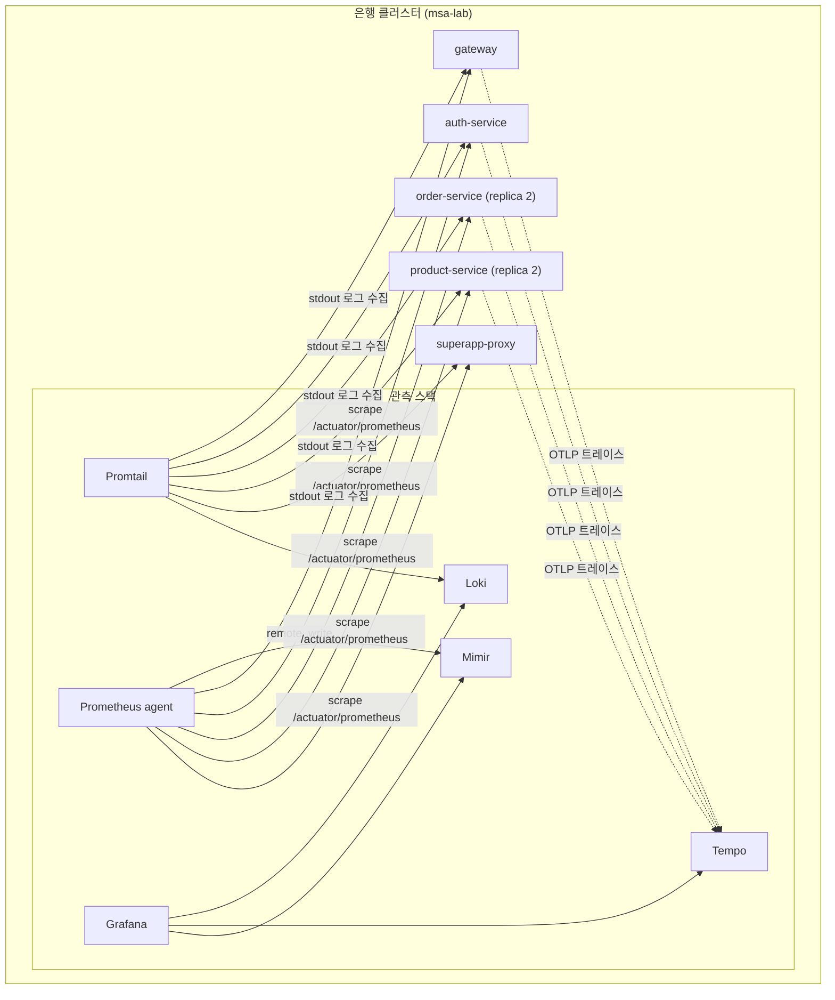
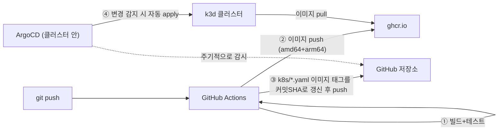
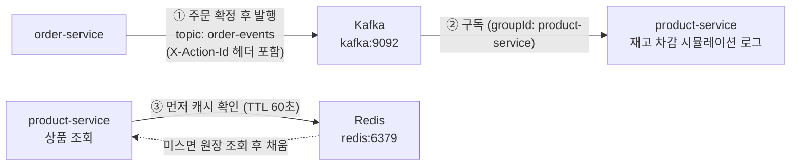
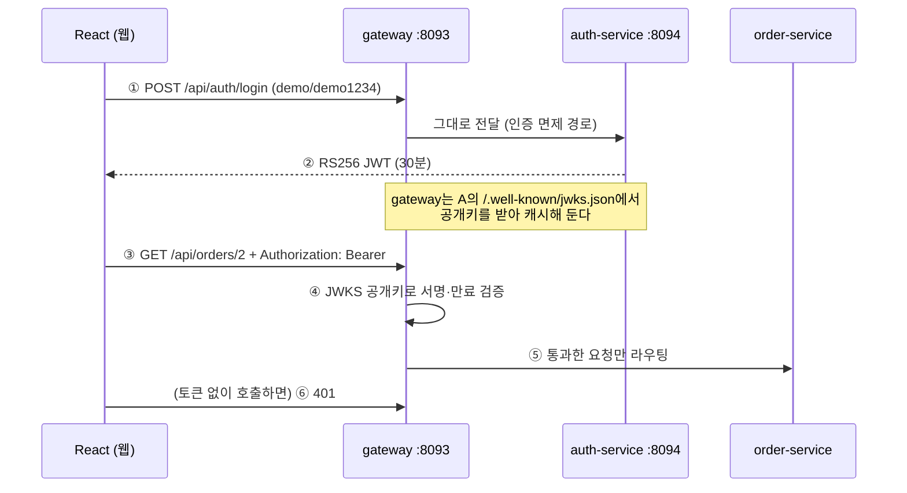
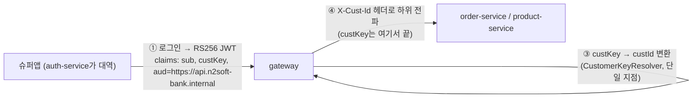
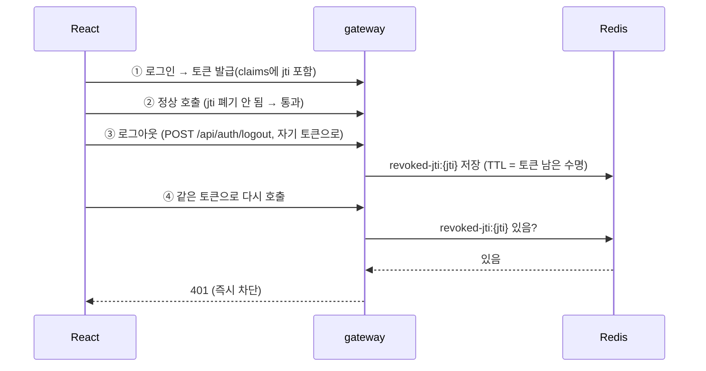
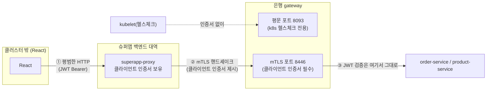

# 흐름 설명 — msa-k3s-lab이 실제로 어떻게 도는가

이 문서는 지금까지 만든 걸 "위에서 아래로 하나의 요청이 흘러가는 순서"로 설명합니다.
코드/설정 자체보다 **왜 이렇게 연결되는지**에 집중합니다.

## 1. 전체 그림

처음엔 React → gateway → order-service → product-service, 3-hop짜리 단순한 그림이었다.
지금은 인증(JWT/JWKS/jti)·mTLS·캐시·이벤트가 붙어서 그 그림 하나로는 더 이상 설명이 안
된다 — 그래서 **요청 경로**(보안·업무 로직)와 **관측 스택**(로그·지표·트레이스)을 나눠서
그린다. 번호 붙은 각 단계의 "왜"는 아래 절(2, 7~11절)에서 하나씩 자세히 다룬다.

### 1.1 요청 경로 — 보안 계층이 쌓인 순서대로



| 단계 | 무슨 일이 일어나나 | 자세히 |
|---|---|---|
| ①·② | 브라우저는 평범한 HTTP만 쓴다 — mTLS는 서버-서버 구간(프록시↔gateway)에서만 일어나고, 인증서가 없으면 TLS 핸드셰이크 자체가 실패한다 | 11절 |
| ③·④ | JWKS 서명 검증(공개키만 공유) → aud로 "우리 시스템용 토큰인지" 확인 → Redis에서 jti 폐기 여부 확인 | 9절, 10절 |
| ⑤ | 슈퍼앱 고객키(custKey)를 내부 고유키(custId)로 바꾸는 유일한 지점. 매핑이 없으면 fail-closed(403) | 9절 |
| ⑥·⑦ | 주문 확정이 비동기로 product-service에 전파된다 — actionId가 Kafka 헤더로도 실려서 HTTP hop과 한 로그로 묶인다 | 7절 |
| ⑧ | 상품 조회는 원장보다 Redis를 먼저 본다 — 캐시 하나가 완전히 다른 두 가지 일(상품 캐시·jti 폐기)에 쓰인다는 것도 주목할 점 | 7절 |

> ⚠️ **이 다이어그램은 랩이 고른 방식이지, 실제 운영 계획과는 다르다.**
> `superapp-proxy`↔`gateway`의 mTLS는 **gateway 자신이 직접 종료**하는 방식(뒤에 나올
> 세 후보 중 옵션 ③)이다. 실제 next.msa 아키텍처에서는 옵션 ①(L4=NetScaler MPX 9230에서
> 종료)의 전제조건인 장비 지원이 확인된 상태다(2026-08-20) — 이 랩은 그와 다른 방식을
> 로컬에서 증명해 본 것뿐이다. 자세한 비교는 11절과 **`MTLS-REVIEW.md`**("mTLS 검토안" 탭) 참고.

### 1.2 관측 스택 — 다섯 서비스의 로그·지표·트레이스가 모이는 곳



**superapp-proxy만 트레이스(Tempo)가 없다** — OTel 자바에이전트를 의도적으로 안 붙였다.
업무 로직이 없는 단순 패스스루라 지금은 로그·지표만으로 충분하다고 판단했다(트레이스가
필요해지면 다른 서비스와 같은 방식으로 붙이면 된다). 로그에는 `custId`까지 MDC 키로 남아서,
Loki에서 actionId 하나로 검색하면 HTTP hop + Kafka 비동기 hop이 전부 한 화면에 묶인다.

## 2. 요청 하나가 흘러가는 순서 (예: "주문하기" 버튼)

1. **React**가 버튼 클릭을 감지하고 `crypto.randomUUID()`로 actionId를 하나 만든다.
   (예: `b1ba2f5c-e3b7-4f24-b055-243dd7c99e42`)
2. React가 `fetch("http://localhost:8888/api/orders/2", { headers: { "X-Action-Id": actionId } })`를 호출한다.
   `localhost:8888`은 k3d가 클러스터 안의 Ingress(Traefik)로 뚫어준 포트다.
3. **gateway**가 요청을 받는다. `CorrelationFilter`가:
   - `X-Action-Id` 헤더를 읽는다 (React가 이미 넣어줬으니 그대로 씀)
   - 이 hop 전용 `requestId`를 새로 만든다
   - 둘 다 로그용 MDC에 넣는다
   - `/api/orders/{id}` 컨트롤러가 `order-service`를 호출할 때, `CorrelationPropagationInterceptor`가
     MDC에 있는 `X-Action-Id`를 **그대로** 아웃바운드 요청 헤더에 실어 보낸다
4. **order-service**가 요청을 받는다. 똑같이 자기 `CorrelationFilter`가 실행되고,
   자기 `requestId`를 새로 만든 뒤 `product-service`를 호출할 때 또 `X-Action-Id`를 그대로 전달한다.
5. **product-service**가 요청을 받아 상품 정보를 응답한다. 이때 실제로 어떤 Pod가 응답했는지도
   `servedBy` 필드로 같이 내려준다(replica가 2개라 매번 다른 Pod가 응답할 수 있음).
6. 응답이 order-service → gateway → React 순으로 되돌아오고, React는 결과와 함께
   자신이 만든 actionId, 그리고 "Grafana에서 이 클릭의 로그 보기" 링크를 화면에 띄운다.

**핵심 — actionId와 requestId의 차이**

| | actionId | requestId |
|---|---|---|
| 언제 만드나 | 맨 처음 (React 버튼 클릭) 딱 한 번 | 각 서비스가 요청을 받을 때마다 |
| 값이 바뀌나 | 전체 흐름 동안 **고정** | hop마다 **매번 새로 생성** |
| 용도 | "이 버튼 클릭 하나"를 서비스 3개에 걸쳐 묶는 열쇠 | 그 서비스 안에서 이 요청 하나를 가리키는 이름 |

## 3. 관측 데이터가 흘러가는 순서

같은 요청이 처리되는 동안, 3개 종류의 신호가 각자 다른 파이프라인을 탄다.

### 3-1. 로그 (Loki)

```
서비스 로그 (JSON, stdout) → Promtail(DaemonSet, 각 Pod의 stdout을 긁음) → Loki → Grafana
```

- 각 서비스는 `logback-spring.xml`의 `LogstashEncoder`로 로그를 JSON 한 줄로 찍는다.
  `{"message":"...", "actionId":"...", "requestId":"...", "service":"gateway", ...}`
- Promtail은 코드를 전혀 모른다 — 그냥 컨테이너의 stdout을 그대로 긁어서 Loki에 넣을 뿐이다.
  JSON 파싱은 Grafana에서 쿼리할 때(`| json`) 또는 그냥 문자열 검색(`|= "actionId"`)으로 한다.
- 그래서 `{namespace="default"} |= "<actionId>"` 한 줄이면 3개 서비스 로그가 다 걸린다 —
  actionId라는 "값"이 세 서비스 로그 문자열 안에 똑같이 박혀있기 때문이다.

### 3-2. 트레이스 (Tempo)

```
OTel Java agent(각 Pod에 -javaagent로 붙어 있음, 코드 변경 없음)
  → OTLP/HTTP로 Tempo(:4318)에 직접 전송
```

- 이건 코드 한 줄도 안 건드렸다 — Dockerfile에서 JVM 실행할 때
  `-javaagent:/app/otel-javaagent.jar`만 붙였다.
- 이 agent가 Spring MVC/RestClient 호출을 자동으로 가로채서 "누가 누구를 호출했는지"를
  트레이스(span)로 기록하고, Tempo로 직접 전송한다.
- **actionId/requestId와는 별개의 상관관계 체계다** — 트레이스는 자체적인 `traceID`로
  같은 요청 체인을 하나로 묶는다. (이 랩에서는 둘을 아직 서로 연결하지 않았다 —
  "다음 단계로 해볼만한 것" 참고)

### 3-3. 메트릭 (Mimir)

```
Spring Boot Actuator(/actuator/prometheus 엔드포인트로 지표 노출)
  ← Prometheus agent가 15초마다 스크레이프
  → remote_write로 Mimir에 push
  → Grafana가 Mimir를 Prometheus 호환 데이터소스로 조회
```

- Prometheus agent는 "에이전트 모드"라서 자기 자신은 조회 기능이 없다 —
  긁어서 밀어넣기만 한다. 실제 조회는 Grafana가 Mimir에 대고 한다.
- `up{job="gateway"}` 같은 지표가 방금 만든 대시보드의 상단 3개 상태 타일이다.

## 4. 실제로 확인해보는 법

1. React 앱(`http://localhost:5173`)에서 버튼을 누른다.
2. 결과 아래 actionId와 "Grafana에서 이 클릭의 로그 보기" 링크가 뜬다 — 클릭하면
   Grafana Explore가 그 actionId로 필터링된 로그만 보여준다(3줄, 서비스 3개).
3. Grafana 대시보드(`http://localhost:3000/d/msa-lgtm-overview`)에서는:
   - 상단 3개 타일 — 서비스가 살아있는지(Mimir 기반)
   - 요청 처리 건수 그래프(Mimir)
   - 최근 로그 스트림(Loki, 실시간)
   - 최근 트레이스 테이블(Tempo) — Trace ID를 클릭하면 실제 span waterfall(어느 서비스가
     얼마나 걸렸는지)까지 볼 수 있다

## 5. 배포 흐름 (ArgoCD) — 코드가 어떻게 클러스터까지 도착하는가



- ①②는 지금까지의 CI와 같다.
- **③이 핵심이다** — ArgoCD는 git만 본다. 이미지가 ghcr에 새로 올라간 것 자체는
  ArgoCD에게 아무 의미가 없다. `k8s/*.yaml`에 적힌 텍스트(이미지 태그)가 바뀌어야
  "spec이 바뀌었다"고 인식한다. 그래서 CI가 `:latest`가 아니라 매번 새 커밋 SHA로
  태그를 고쳐 쓰고 git에 커밋한다.
- ④에서 사람이 `kubectl`을 칠 일이 없다 — ArgoCD가 스스로 git과 클러스터 상태를
  비교하다가 다르면 동기화(`syncPolicy.automated`)한다.

## 6. 다음 단계로 해볼만한 것

- **트레이스와 로그 연결**: OTel agent가 남긴 `traceID`를 MDC에도 넣으면, 로그 한 줄 →
  버튼을 눌러 그 요청의 정확한 span waterfall로 바로 이동하는 것도 가능해진다
  (Grafana의 "Loki → Tempo derived field" 기능).
- **Pod 단위 메트릭**: 지금은 Service를 스크레이프해서 replica 2개 중 하나만 잡힌다 —
  `kubernetes_sd_configs(role: pod)`로 바꾸면 Pod별로 다 잡을 수 있다.
- **알림(Alerting)**: Mimir 지표 기준으로 "에러율 5% 초과 시 알림" 같은 룰을 Grafana에 걸어보기.

## 7. 주문 이벤트와 캐시 — Kafka·Redis가 끼어드는 지점

HTTP 요청-응답 체인(위 2절)에 두 가지 비동기/가속 장치가 추가됐습니다.



- **주문 이벤트 (Kafka)** — order-service는 주문 응답을 돌려준 것과 별개로 `order-events` 토픽에
  주문 사실을 발행한다. product-service가 이를 구독해 재고 차감을 시뮬레이션한다.
  요청을 만든 actionId가 **Kafka 레코드 헤더(X-Action-Id)** 로도 전파되므로, Grafana에서
  같은 actionId로 검색하면 HTTP hop 로그와 **비동기 hop 로그까지 한 줄에 묶인다** —
  발행이 실패해도 주문 응답은 실패하지 않는다(경고 로그만 남음).
- **상품 캐시 (Redis)** — product-service는 상품 조회 시 `product:{id}` 키를 먼저 본다.
  적중하면 원장 조회(200ms 지연 시뮬레이션)를 건너뛰고, 미스면 원장을 읽어 60초 TTL로 채운다.
  응답의 `source` 필드가 `redis-cache`/`origin` 으로 표시되므로 화면에서 두 번 연속 조회해보면
  차이가 바로 보인다. **Redis가 죽어도 조회는 원장으로 계속 동작한다** — 캐시는 가속 장치이지
  의존성이 아니다.

## 8. 인증 — 로그인부터 401까지 (JWKS 패턴)

실서비스의 "슈퍼앱 → BFF 진입 → 토큰 검증 → 분기" 구조를 웹 페이지로 축소한 것입니다.
**인증 경계는 gateway 하나** — 통과한 요청만 하위 서비스로 내려가고, order/product는
토큰을 다시 검사하지 않습니다(클러스터 내부 신뢰).



- **JWKS의 요점** — auth-service는 개인키로 서명만 하고, gateway는 `/.well-known/jwks.json`의
  **공개키로 검증만** 한다. 두 서비스가 비밀을 공유하지 않으므로 검증측이 늘어나도(모바일 BFF,
  외부 BFF…) 키 배포 문제가 없다. 실서비스에서 슈퍼앱 BFF가 같은 방식으로 검증하는 이유.
- **왜 gateway에서만 검증하나** — 토큰 검사를 서비스마다 반복하면 모든 서비스가 auth를 의존하게
  된다. 외부 진입점이 gateway 하나뿐이므로(order/product는 ClusterIP) 경계 한 곳 검증으로 충분하다.
- **랩의 제약** — auth-service의 서명키는 파드 메모리에만 있어 replica 1 고정이고, 재기동하면
  기존 토큰이 전부 무효가 된다(재로그인). 실서비스는 키를 공유 저장소에 두고 kid 기반으로 회전한다.
- 화면에서 해볼 것: 로그인 없이 주문 → **401**, 로그인 후 주문 → 정상. auth-service 파드를
  지워 재기동시킨 뒤 기존 토큰으로 호출 → 401(키 교체 체험).

## 9. 슈퍼앱 연계 — 외부 고객키를 내부 고유키로 (aud 검증 + fail-closed)

"슈퍼앱에서 로그인된 상태로 우리 시스템에 들어온다"는 실서비스 시나리오를 얹은 것입니다.
**고객이 우리 내부망에 직접 로그인하지 않습니다** — 슈퍼앱(IdP)이 발급한 토큰을 우리가 검증만
합니다. auth-service는 지금부터 "슈퍼앱 IdP를 흉내낸 것"입니다.



- **claims 확장** — 토큰에 `custKey`(슈퍼앱 고객키)와 `aud: "https://api.n2soft-bank.internal"`가 실립니다. `aud`가
  "이 토큰이 누구에게 발급됐는가"를 말해주는 필드입니다.
- **왜 aud 검증이 필수인가** — 서명 검증만으로는 "같은 IdP가 발급한 진짜 토큰"인지만 압니다.
  같은 슈퍼앱이 **다른 제휴사(https://api.partner-mall.example)용**으로 서명한 토큰도 서명 검증은 통과합니다.
  gateway의 `SecurityConfig.jwtDecoder()`가 기본 검증(서명·만료)에 audience 검증을 추가로
  붙였고, 이게 없으면 "제휴사용 토큰 재사용" 공격이 그대로 성립합니다. 화면의
  **"다른 제휴사용 토큰 재사용 공격"** 카드가 이걸 실측으로 보여줍니다.
- **외부 키 → 내부 키 변환은 한 곳에서, fail-closed** — `CustomerKeyResolver`(gateway)가
  유일한 변환 지점입니다. 이 아래로는 custKey가 절대 흐르지 않고, order/product는 `X-Cust-Id`
  (내부 고유키)만 받습니다. 매핑이 없으면(데모 계정 `guest`, custKey=`SA-99999`) 즉시 403으로
  끊습니다 — "고객 없음"과 "권한 없음"을 구분해 알려주면 고객키 열거 공격의 재료가 되므로
  항상 같은 응답으로 거부합니다.
- **화면에서 해볼 것**: demo/kim으로 로그인 후 조회·주문(정상) → guest로 로그인 후 조회·주문
  (403, fail-closed) → "다른 제휴사용 토큰 재사용 공격" 카드로 aud 검증 실측.

**이 랩이 보여주지 않는 것(실서비스에서 추가로 필요)**: 기관 간 채널 인증(mTLS), 민감 거래의
step-up 인증(계좌비밀번호/OTP), jti 기반 재사용 방지, 연계 규약 문서화. custId만 넘기고 끝나는
게 아니라 "이 정도까지가 코드로 보여줄 수 있는 부분"이라는 경계를 분명히 해두는 것도 중요합니다.

## 10. 로그아웃의 즉시성 — jti 폐기 목록 (Redis)

JWT는 태생적으로 무상태입니다. 서명·aud·만료만 검증하는 지금까지의 구조에서는, 토큰이
탈취되면 **로그아웃을 눌러도 만료 시각(30분)까지 그 토큰이 계속 유효**합니다 — 클라이언트가
메모리에서 토큰을 지우는 것과, 그 토큰이 서버에서 무효가 되는 것은 별개입니다.



- **왜 필요한가** — 서명·aud·exp 검증은 "이 토큰이 위조되지 않았고, 우리 시스템용이고, 아직
  만료 전인가"만 봅니다. "이 토큰을 지금 당장 못 쓰게 하고 싶다"(로그아웃, 기기 도난 신고,
  관리자 강제 로그아웃)는 별개의 요구라 별도 장치가 필요합니다.
- **TokenRevocationService**(gateway)가 Redis에 `revoked-jti:{jti}` 키를 두는 유일한 지점입니다.
  로그아웃 시 **남은 수명만큼만** TTL을 주므로(이미 만료될 토큰을 무한정 저장하지 않음) 폐기
  목록이 무한정 커지지 않습니다.
- **fail-open으로 설계** — Redis가 응답하지 않으면 폐기 여부를 "모름"으로 보고 **통과**시킵니다.
  CustomerKeyResolver(9절, 외부 키→내부 키 변환)의 fail-closed와 정반대 선택인데, 이유가
  다릅니다: 폐기 목록은 서명·aud·exp라는 1차 방어선 위에 얹는 부가 방어선이라 가용성을
  우선했고, 고객 매핑은 실패하면 "누구인지 모르는 요청을 처리해버리는" 더 큰 사고로 이어지므로
  가용성보다 안전을 우선했습니다. 같은 "실패 시 어떻게 할까" 질문에 상황마다 다른 답을
  내린 사례입니다.
- **화면에서 해볼 것**: "로그아웃 후 같은 토큰 재사용" 카드 — 로그인 → 정상 호출(200) →
  로그아웃 → **같은 토큰**으로 재호출하면 401이 나야 정상입니다. 이 필터가 없다면 마지막
  호출도 200이 나옵니다(무상태 JWT의 기본 동작).

**이 랩이 다루지 않는 것**: 이건 "세션 하나를 조기 종료"하는 장치이지, 9절에서 언급한 진짜
1회용 토큰(nonce, 이체 확인 콜백 같은 단일 목적 토큰의 재사용 방지)과는 다른 용도입니다.

## 11. mTLS — "이 연결이 진짜 슈퍼앱 서버에서 왔는가"

지금까지(9~10절)의 JWT·aud·jti는 전부 **"이 요청이 진짜 고객의 것인가"**를 증명하는
장치였다. 그런데 다른 질문이 하나 더 있다 — **"이 연결이 진짜 슈퍼앱의 서버에서 온 것인가"**.
토큰이 로그 유출 등으로 새어나갔다면, 서명·aud·jti 검증만으로는 **어디서 호출하든**(공격자의
서버 포함) 막을 방법이 없다. mTLS(상호 TLS)가 이 빈틈을 메운다.

### 왜 브라우저가 아니라 서버-서버 구간에 거는가

실제 구조는 "슈퍼앱 최종사용자 앱 → 슈퍼앱 백엔드 → (mTLS) → 은행 gateway"다. 브라우저가
클라이언트 인증서를 직접 제시하는 UX는 OS 인증서 선택 팝업이 뜨는 등 이 데모 화면과 안 맞을
뿐 아니라, 애초에 mTLS를 거는 지점 자체가 아니다. 그래서 **superapp-proxy**라는 서비스를
"슈퍼앱 백엔드" 대역으로 하나 두고, React(브라우저, 슈퍼앱의 최종사용자 앱 대역)는 지금까지와
똑같이 평범한 HTTP로 이 프록시를 부른다 — React 코드는 한 줄도 안 바뀐다.



### 두 포트로 나눈 이유

| | 포트 | 역할 |
|---|---|---|
| 평문 HTTP | 8093 | k8s 헬스체크(readiness/liveness) 전용. kubelet은 인증서를 제시하지 않으므로, 이 포트가 mTLS까지 요구하면 애초에 파드가 Ready 판정을 못 받는다 |
| mTLS | 8446 | 업무 트래픽 전부. `PlainPortRestrictionFilter`가 평문 포트로 들어온 업무 경로 요청을 **JWT 검증 이전에** 403으로 끊는다 — "이게 JWT 문제가 아니라 채널(포트) 문제"라는 걸 분명히 하기 위해 Spring Security 필터보다 앞에 둔다 |

### 상호(mutual) 검증 — 양쪽 다 확인한다

- **gateway → superapp-proxy**: mTLS 포트가 `certificateVerification = "required"`로, 클라이언트
  인증서가 없거나 CA가 다르면 **TLS 핸드셰이크 자체가 실패**한다. HTTP 요청이 오가기도 전에 끝난다.
- **superapp-proxy → gateway**: superapp-proxy도 gateway의 서버 인증서가 이 랩의 CA가 서명한
  게 맞는지 검증한다(자체 트러스트스토어로). 클라이언트 인증서만 보내고 서버 검증을 생략하면,
  가짜 gateway에게 요청을 그대로 넘겨버리는 것과 같아서 양방향 다 확인해야 "상호" TLS다.

### 인증서는 Git에 없다

`k8s/mtls/generate-certs.sh`가 이 랩 전용 자체서명 CA와 인증서를 로컬에 생성하고,
`k8s/mtls/load-secrets.sh`가 그걸 k8s Secret으로 클러스터에 직접 적용한다 — **ArgoCD(Git)
동기화 대상이 아니다.** next.msa의 비밀값 정책과 같은 이유다: 비밀값은 Git이 아니라 클러스터에
직접 주입한다. `certs/` 디렉터리는 `.gitignore` 대상이라 개인키가 저장소에 남지 않는다.

### 화면·터미널에서 해볼 것

- **React 화면**: 로그인·주문·로그아웃 등 지금까지의 모든 기능이 그대로 동작한다 — 배선이
  `React → superapp-proxy → (mTLS) → gateway`로 바뀌었을 뿐, 브라우저 쪽은 아무것도 안
  바뀌었다.
- **터미널** (클러스터 안, `kubectl exec`로): gateway의 mTLS 포트(8446)에 인증서 없이 접속하면
  TLS 핸드셰이크 자체가 실패한다. 평문 포트(8093)로 업무 경로를 직접 부르면 403이 난다 — 둘 다
  "완벽히 유효한 JWT를 들고 있어도" 통하지 않는다는 게 요점이다.
- 이제 클러스터 **밖에서 gateway를 직접 부를 방법이 없다** — Ingress가 superapp-proxy만
  가리키므로, gateway의 Service는 ClusterIP로만 존재한다. 외부에서 도달 가능한 것은
  superapp-proxy 하나뿐이다.

### 이 랩이 다루지 않는 것

인증서 회전·폐기(CRL/OCSP), CA 자체의 보안(개인키 보관), 실제 서비스 메시(Istio/Linkerd
같은 내부 mTLS — 이건 클러스터 **밖**의 파트너와의 mTLS라 서비스 메시와는 다른 문제다)는
다루지 않는다. 이 랩의 CA는 "이 랩 전용 자체서명 CA"이지 신뢰할 수 있는 실제 CA가 아니다.

### 이 랩의 배선 = 실제 운영 계획이 아니다

위 1.1절 다이어그램은 **gateway 애플리케이션 자신이 mTLS를 직접 종료**하는 방식이다 —
아래 "실제 아키텍처 대비 검토"에서 정리한 옵션 중 **옵션 ③**에 해당한다. 이 방식을 고른
이유는 로컬 k3d 클러스터에는 실제 L4 로드밸런서나 Envoy Gateway 같은 물리적/상용 장비가
없어서, 애플리케이션 코드 안에서 가장 확실하게 mTLS를 구현·검증할 수 있는 지점이었기
때문이지, "실제 운영에서도 이렇게 한다"는 결론이 아니다.

실제 next.msa 아키텍처(`infra/architecture.drawio`)는 채널BFF(AWS) → L4 로드밸런서 →
Envoy Gateway → gateway로 이어지는 더 긴 체인이다. mTLS를 어디서 종료할지 L4에서
종료(옵션 ①), Envoy Gateway에서 종료(옵션 ②), gateway 자신에서 종료(옵션 ③, 이 랩과
동일) 세 가지를 비교했고, 옵션 ①의 전제조건인 L4 장비 지원은 확인이 끝났다(2026-08-20)
— 실제 L4 장비가 Citrix NetScaler MPX 9230(Fixed Term 구독, Advanced/Premium, 30Gbps)이고
클라이언트 인증서 검증·헤더 삽입/삭제 세 기능 모두 지원된다. 비교 과정과 근거는
**`MTLS-REVIEW.md`**("mTLS 검토안" 탭)에 있다. 이 랩은 옵션 ③이 "실제로 동작한다"는 것을
증명한 프로토타입이다.
