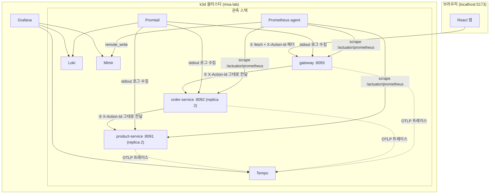

# 흐름 설명 — msa-k3s-lab이 실제로 어떻게 도는가

이 문서는 지금까지 만든 걸 "위에서 아래로 하나의 요청이 흘러가는 순서"로 설명합니다.
코드/설정 자체보다 **왜 이렇게 연결되는지**에 집중합니다.

## 1. 전체 그림



## 2. 요청 하나가 흘러가는 순서 (예: "주문하기" 버튼)

1. **React**가 버튼 클릭을 감지하고 `crypto.randomUUID()`로 actionId를 하나 만든다.
   (예: `b1ba2f5c-e3b7-4f24-b055-243dd7c99e42`)
2. React가 `fetch("http://localhost:8888/api/orders/2", { headers: { "X-Action-Id": actionId } })`를 호출한다.
   `localhost:8888`은 k3d가 클러스터 안의 Ingress(Traefik)로 뚫어준 포트다.
3. **gateway**가 요청을 받는다. `CorrelationFilter`가:
   - `X-Action-Id` 헤더를 읽는다 (React가 이미 넣어줬으니 그대로 씀)
   - 이 hop 전용 `requestId`를 새로 만든다
   - 둘 다 로그용 MDC에 넣는다
   - `/api/orders/{id}` 컨트롤러가 `order-service`를 호출할 때, `CorrelationPropagationInterceptor`가
     MDC에 있는 `X-Action-Id`를 **그대로** 아웃바운드 요청 헤더에 실어 보낸다
4. **order-service**가 요청을 받는다. 똑같이 자기 `CorrelationFilter`가 실행되고,
   자기 `requestId`를 새로 만든 뒤 `product-service`를 호출할 때 또 `X-Action-Id`를 그대로 전달한다.
5. **product-service**가 요청을 받아 상품 정보를 응답한다. 이때 실제로 어떤 Pod가 응답했는지도
   `servedBy` 필드로 같이 내려준다(replica가 2개라 매번 다른 Pod가 응답할 수 있음).
6. 응답이 order-service → gateway → React 순으로 되돌아오고, React는 결과와 함께
   자신이 만든 actionId, 그리고 "Grafana에서 이 클릭의 로그 보기" 링크를 화면에 띄운다.

**핵심 — actionId와 requestId의 차이**

| | actionId | requestId |
|---|---|---|
| 언제 만드나 | 맨 처음 (React 버튼 클릭) 딱 한 번 | 각 서비스가 요청을 받을 때마다 |
| 값이 바뀌나 | 전체 흐름 동안 **고정** | hop마다 **매번 새로 생성** |
| 용도 | "이 버튼 클릭 하나"를 서비스 3개에 걸쳐 묶는 열쇠 | 그 서비스 안에서 이 요청 하나를 가리키는 이름 |

## 3. 관측 데이터가 흘러가는 순서

같은 요청이 처리되는 동안, 3개 종류의 신호가 각자 다른 파이프라인을 탄다.

### 3-1. 로그 (Loki)

```
서비스 로그 (JSON, stdout) → Promtail(DaemonSet, 각 Pod의 stdout을 긁음) → Loki → Grafana
```

- 각 서비스는 `logback-spring.xml`의 `LogstashEncoder`로 로그를 JSON 한 줄로 찍는다.
  `{"message":"...", "actionId":"...", "requestId":"...", "service":"gateway", ...}`
- Promtail은 코드를 전혀 모른다 — 그냥 컨테이너의 stdout을 그대로 긁어서 Loki에 넣을 뿐이다.
  JSON 파싱은 Grafana에서 쿼리할 때(`| json`) 또는 그냥 문자열 검색(`|= "actionId"`)으로 한다.
- 그래서 `{namespace="default"} |= "<actionId>"` 한 줄이면 3개 서비스 로그가 다 걸린다 —
  actionId라는 "값"이 세 서비스 로그 문자열 안에 똑같이 박혀있기 때문이다.

### 3-2. 트레이스 (Tempo)

```
OTel Java agent(각 Pod에 -javaagent로 붙어 있음, 코드 변경 없음)
  → OTLP/HTTP로 Tempo(:4318)에 직접 전송
```

- 이건 코드 한 줄도 안 건드렸다 — Dockerfile에서 JVM 실행할 때
  `-javaagent:/app/otel-javaagent.jar`만 붙였다.
- 이 agent가 Spring MVC/RestClient 호출을 자동으로 가로채서 "누가 누구를 호출했는지"를
  트레이스(span)로 기록하고, Tempo로 직접 전송한다.
- **actionId/requestId와는 별개의 상관관계 체계다** — 트레이스는 자체적인 `traceID`로
  같은 요청 체인을 하나로 묶는다. (이 랩에서는 둘을 아직 서로 연결하지 않았다 —
  "다음 단계로 해볼만한 것" 참고)

### 3-3. 메트릭 (Mimir)

```
Spring Boot Actuator(/actuator/prometheus 엔드포인트로 지표 노출)
  ← Prometheus agent가 15초마다 스크레이프
  → remote_write로 Mimir에 push
  → Grafana가 Mimir를 Prometheus 호환 데이터소스로 조회
```

- Prometheus agent는 "에이전트 모드"라서 자기 자신은 조회 기능이 없다 —
  긁어서 밀어넣기만 한다. 실제 조회는 Grafana가 Mimir에 대고 한다.
- `up{job="gateway"}` 같은 지표가 방금 만든 대시보드의 상단 3개 상태 타일이다.

## 4. 실제로 확인해보는 법

1. React 앱(`http://localhost:5173`)에서 버튼을 누른다.
2. 결과 아래 actionId와 "Grafana에서 이 클릭의 로그 보기" 링크가 뜬다 — 클릭하면
   Grafana Explore가 그 actionId로 필터링된 로그만 보여준다(3줄, 서비스 3개).
3. Grafana 대시보드(`http://localhost:3000/d/msa-lgtm-overview`)에서는:
   - 상단 3개 타일 — 서비스가 살아있는지(Mimir 기반)
   - 요청 처리 건수 그래프(Mimir)
   - 최근 로그 스트림(Loki, 실시간)
   - 최근 트레이스 테이블(Tempo) — Trace ID를 클릭하면 실제 span waterfall(어느 서비스가
     얼마나 걸렸는지)까지 볼 수 있다

## 5. 다음 단계로 해볼만한 것

- **트레이스와 로그 연결**: OTel agent가 남긴 `traceID`를 MDC에도 넣으면, 로그 한 줄 →
  버튼을 눌러 그 요청의 정확한 span waterfall로 바로 이동하는 것도 가능해진다
  (Grafana의 "Loki → Tempo derived field" 기능).
- **Pod 단위 메트릭**: 지금은 Service를 스크레이프해서 replica 2개 중 하나만 잡힌다 —
  `kubernetes_sd_configs(role: pod)`로 바꾸면 Pod별로 다 잡을 수 있다.
- **알림(Alerting)**: Mimir 지표 기준으로 "에러율 5% 초과 시 알림" 같은 룰을 Grafana에 걸어보기.
