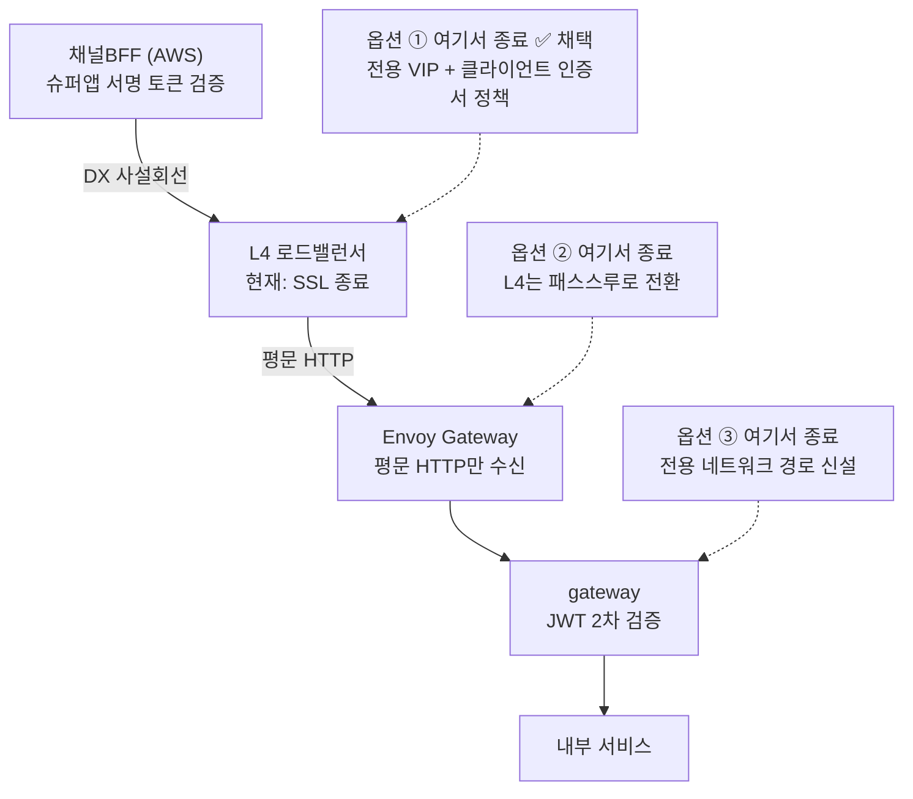

# 슈퍼앱 연동 mTLS 검토안

근거 문서: `infra/architecture.drawio`(next.msa 실제 설계) · 비교 대상: `msa-k3s-lab`(로컬 검증 랩)

현재 상태: **옵션 ① — L4(NetScaler MPX 9230)에서 종료 — 채택 확정(2026-08-20)**.
architecture.drawio에는 아직 mTLS가 반영돼 있지 않았고, 이 문서는 넣을지 말지부터
검토해 실제 장비로 지원 여부까지 확인한 과정과 결론을 정리한 것이다.

## 1. 배경

슈퍼앱 고객은 이미 로그인된 상태로 우리 API를 호출한다. 이 연동이 DX(전용회선)를 타지만,
DX는 사설망일 뿐 암호화나 호출자 신원을 보장하지 않는다 — 그래서 mTLS(상호 TLS)를 채널
인증으로 추가할지 검토했다.

실제 `architecture.drawio`를 열어보니, 채널BFF(AWS) → L4 로드밸런서 → Envoy Gateway →
gateway로 이어지는 구간에서 **JWT 서명 검증은 이미 설계돼 있지만 mTLS는 어디에도 없다.**
L4가 "SSL 종료(HTTPS→HTTP)"만 하고 그 뒤로는 전부 평문이다 — 즉 지금 계획은
"DX + 편도 TLS + 매 요청 JWT 검증" 조합이다.

## 2. 랩 검증 vs 실제 설계 비교

`msa-k3s-lab`에서 검증한 보안 계층 각각이 실제 문서에 반영돼 있는지 대조했다.

| 개념 | 랩(msa-k3s-lab) | 실제 설계(architecture.drawio) |
|---|---|---|
| 슈퍼앱 고객키(custKey), 로그인 없이 전달 | 검증됨 | ✅ 반영됨 — mobileApp 박스 |
| JWKS 발급 주체 분리(슈퍼앱이 발급, 우리는 검증만) | 검증됨 | ✅ 반영됨 — jwks 박스 |
| gateway의 JWT 2차 검증 | 검증됨(고객 토큰만) | ✅ 반영됨 — 직원+고객 iss/aud 분기, 랩보다 범위 넓음 |
| custKey → 내부 고유키(cust_unno) 변환 지점 | 검증됨(fail-closed) | ⚠️ 불명확 — 문서에 변환 위치 없음 |
| jti 폐기 — 로그아웃 즉시 반영 | 검증됨(Redis) | ⚠️ 없음 — 확인 필요 |
| mTLS(채널 인증) | 검증됨 | ⚠️ 없음 — 이 문서의 검토 대상 |

## 3. mTLS 종료 지점 후보

실제 체인에서 mTLS 핸드셰이크를 받아 처리할 수 있는 지점은 세 곳이다. TLS 세션은
어딘가에서 반드시 끝나고, 그 지점 이후로는 검증된 신원을 다른 방식(헤더, 애플리케이션
세션 등)으로 전달해야 한다.

점선 화살표가 "여기서 mTLS를 받는다면"을 가리킨다. 실선은 지금 실제로 흐르는 트래픽
경로다.

## 4. 옵션별 비교

### 옵션 ① — L4 로드밸런서에서 종료 ✅ 채택 (변경 범위: 최소)

- **방법**: 슈퍼앱 전용 VIP 신설 → 그 리스너에만 클라이언트 인증서 요구 → 검증된 CN을
  헤더로 하위 전달(예: `X-Client-Cert-CN`) → 원본 요청에 같은 헤더가 있으면 L4가
  제거(sanitize)
- **장점**: Envoy Gateway·gateway 코드 변경 거의 없음. 기존 직원 트래픽(브라우저·Electron)
  경로는 그대로 유지
- **전제조건 — 확인 완료(2026-08-20)**: 실제 L4는 Citrix NetScaler MPX 9230(Fixed Term
  Software 구독, 30Gbps, Advanced/Premium 등급). 클라이언트 인증서 검증(`-clientAuth
  ENABLED -clientCert MANDATORY`) + Rewrite 기반 헤더 삽입(`insert_http_header`) + 헤더
  삭제/sanitize(`delete_http_header`) 세 가지 모두 Standard 등급 기능이라 Advanced/Premium
  라이선스에 전부 포함 — 별도 애드온 없이 사용 가능. 상세는 5절 참고
- **단점**: 신원 증명이 "TLS 세션"이 아니라 "L4가 만든 헤더를 하위가 신뢰"하는 모델 —
  L4~gateway 구간이 폐쇄망이어야 안전

### 옵션 ② — Envoy Gateway에서 종료 (변경 범위: 중간)

- **방법**: 해당 VIP만 L4를 SSL 종료 대신 TCP/SNI 패스스루로 전환 → TLS 세션이 그대로
  Envoy Gateway까지 도달 → `ClientTrafficPolicy`로 인증서 검증
- **장점**: 벤더 제약 없음(오픈소스, 우리가 직접 설정). TLS 세션이 검증 지점까지 안
  끊겨서 헤더 신뢰 모델보다 원칙적으로 더 깔끔함
- **전제조건**: L4가 최소한 "TCP 패스스루"는 지원해야 함 — 이건 클라이언트 인증서
  검증보다 훨씬 기본적인 기능이라 대부분의 장비가 지원
- **단점**: 같은 L4가 직원 트래픽도 처리하므로, 슈퍼앱 트래픽만 골라 패스스루로 바꾸는
  리스너 분리 작업이 필요

### 옵션 ③ — gateway 애플리케이션에서 종료 (변경 범위: 큼, 랩에서 검증된 방식)

- **방법**: gateway(Spring Boot)가 자체 mTLS 리스너를 추가로 열어 직접 인증서 검증 —
  `msa-k3s-lab`에서 이미 구현·검증한 구조와 동일
- **장점**: 애플리케이션 코드 안에서 세밀한 제어 가능. 인프라 장비 기능에 의존하지 않음
- **전제조건**: Envoy Gateway의 HTTPRoute 라우팅을 완전히 우회하는 전용 네트워크
  경로(별도 NodePort 등) 신설 필요
- **단점**: next.msa의 기존 관례(모든 트래픽이 Envoy Gateway를 거쳐 헤더 전파·관측이
  일관됨)에서 벗어나는 예외 경로가 하나 생김

## 5. L4 장비 지원 여부 확인 — 확인 완료

실제 장비: **Citrix NetScaler MPX 9230**, Fixed Term Software 구독 라이선스, Throughput
30Gbps. 아래 네 가지를 웹 검색으로 확인했다.

| 확인 항목 | 결과 |
|---|---|
| 리스너(VIP) 단위 클라이언트 인증서 요구 | ✅ 지원 — `set ssl vserver <name> -clientAuth ENABLED -clientCert MANDATORY` |
| 검증된 인증서 정보(CN 등)를 헤더로 하위 전달 | ✅ 지원 — Rewrite(AppExpert) 액션으로 `insert_http_header X-Client-Cert-CN "CLIENT.SSL.CLIENT_CERT.SUBJECT.VALUE(\"CN\")"` |
| 원본 요청에 같은 헤더가 있으면 제거(sanitize) | ✅ 지원 — Rewrite 액션 `delete_http_header`를 `HTTP.REQ.HEADER("X-Client-Cert-CN").EXISTS` 조건으로 먼저 실행(삽입보다 먼저 적용되도록 정책 우선순위 주의) |
| 지금 라이선스에 이 기능이 활성화돼 있는가 | ✅ Fixed Term 구독은 Advanced/Premium 등급만 판매(Standard 단종) — SSL 오프로드·클라이언트 인증서 인증·Rewrite는 전부 Standard 등급 핵심 기능이라 Advanced/Premium 어느 쪽에도 기본 포함. Premium이 추가로 주는 건 WAF/Bot/IP Reputation처럼 이번에 필요 없는 기능뿐 |

**결론: 세 가지 요구사항 모두 지금 장비·라이선스로 별도 구매 없이 가능 — 옵션 ① 채택.**

## 6. L4가 지원하지 않을 경우 (참고 — 이번엔 해당 없음)

5절에서 ①번이 확인돼 아래 대안은 실제로는 필요 없어졌다. 다음에 다른 장비/구간에서
같은 검토가 필요할 때를 위해 순서만 기록으로 남긴다.

**A. 옵션 ②(Envoy Gateway)로 이동** — 사실상 기본 대안. Envoy Gateway는 우리가 직접
운영하는 오픈소스라 벤더 제약이 없다. 이때 L4에 요구되는 건 클라이언트 인증서 검증이
아니라 **TCP 패스스루**라는 훨씬 기본적인 기능이라, 거의 모든 L4가 여기까지는 지원한다.

**B. (패스스루조차 안 되는 경우, 매우 드묾) 별도 mTLS 종료 프록시 신설** — L4와 Envoy
Gateway 사이에 이 역할만 하는 가벼운 프록시(HAProxy·Nginx·Envoy)를 하나 세운다.
컴포넌트가 늘어나는 대가는 있지만 인프라 제약과 무관하게 항상 가능하다.

**C. (TLS 계층 자체를 바꿀 수 없는 극단적인 경우) 애플리케이션 레벨 서명 요청으로 대체**
— mTLS 대신 채널BFF가 요청을 자기 개인키로 서명해서 보내고 우리가 검증하는
방식(AWS SigV4·웹훅 서명 검증과 같은 패턴). TLS 핸드셰이크 단계의 보장(연결 자체가
안 됨)만큼 강하진 않지만 "권한 없는 호출자 차단"이라는 목적은 달성한다.

## 7. 다음 단계 (옵션 ① 채택 이후)

1. NetScaler에 슈퍼앱 전용 SSL vserver 신설 — 기존 API용 VIP와 분리
2. 그 vserver에 `-clientAuth ENABLED -clientCert MANDATORY` 설정 + 슈퍼앱 클라이언트
   인증서를 신뢰할 CA를 vserver에 바인딩
3. Rewrite 정책 2개 구성 — ① 원본 요청의 `X-Client-Cert-CN` 헤더 제거(sanitize, 스푸핑
   방지) → ② 검증된 인증서 CN을 같은 이름으로 재삽입. 순서가 바뀌면 클라이언트가 보낸
   위조 헤더가 그대로 통과한다
4. Envoy Gateway/gateway 쪽에 `X-Client-Cert-CN` 헤더 신뢰 필터 추가 — 이 경로로 들어온
   요청에서만 이 헤더를 신뢰(다른 경로로 들어오면 거부)
5. 미해결 항목 마저 정리 — custKey→cust_unno 변환 지점을 어디(gateway? customer-service?)로
   할지, 고객 토큰의 로그아웃/폐기(jti revocation) 개념이 필요한지
